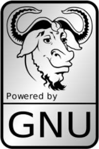
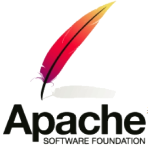
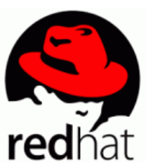
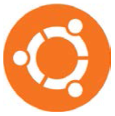

# Linux 学习笔记（一）Linux 简介

* 本笔记基于 刘遄 的《Linux 就该这么学》一书。

## Linux 简介

### 书籍前言

* "工作马马虎虎，只想在兴趣和游戏中寻觅快活，充其量只能获得一时的快感，绝不能尝到从心底用处的惊喜和快乐，但来自工作的喜悦并不像糖果那样——放进嘴里就甜味十足，而是需要从苦劳与艰辛中渗出，因此当我们聚精会神，孜孜不倦，克服艰辛后的成就感，世上没有哪种喜悦可以类比。"

### 开源共享

* 对于开源软件，用户具有**使用自由**、**修改自由**、**重新发布自由**以及**创建衍生品的自由**。
* 开源软件的重要特性：**低风险**、**高品质**、**低成本**、**更透明**。

#### 开源许可协议

##### GNU GPL

* GNU General Public License，GNU 通用公共许可证。
* 遵循 GPL 协议的产品或代码，必须开源、免费，因此这个协议并**不适合商用软件**。
* 包括 Linux 系统在内的大多数开源软件都是基于该协议的。
* GPL 开源许可协议最大的 4 个特点：
  * 复制自由：允许软件复制到任何人的电脑中，并不限制复制的数量。
  * 传播自由：允许软件以各种形式进行传播。
  * 收费传播：允许在各种媒介出售该软件，通过为用户提供**有偿服务**的形式盈利。
  * 修改自由：允许增加或删除软件功能。

##### BSD

* Berkeley Software Distribution，伯克利软件发布版许可协议。
* 可以将软件**作为商业软件发布**和销售。
* 需要满足下面3个条件：
  * 如果发布软件中包含源代码，必须遵循 BSD 许可。
  * 如果发布软件中只有二进制程序，则需要声明原始代码遵循了 BSD 协议。
  * 不允许用原始软件的名字、作者名字或机构名称进行市场推广。

##### Apache

* Apache License Version，Apache 许可证版本许可协议。
* 允许用户修改代码和再发布。适用于商业软件。
* 需要满足下面的4个条件：
  * 该软件及其衍生品必须继续使用 Apache 许可协议。
  * 如果修改了程序源代码，需要在文档中进行声明。
  * 若软件基于他人的源代码编写，需要保留原始代码的协议、商标、专利声明和原作者声明。
  * 有声明文件，需标注 Apache 许可协议及其他协议。

##### MPL

* Mozilla Public License，Mozilla 公共许可协议。
* 注重对开发者源代码需求和受益之间的平衡。

##### MIT

* Massachusetts Institude of Technology，MIT 许可协议。
* 限制最少的许可协议，普遍被商业软件所使用。

### 为什么学习 Linux？

#### 历史

* 20世纪70年代：UNIX 系统开源且免费。
* 1979：AT&T 公司对 UNIX 系统的商业化。（不再开源）
* 1984：Richard Stallman 发起 GNU 源代码开发计划，制定了 GPL 许可协议。
* 1987：GNU 计划的重大突破—— gcc 编译器发布。
* 1991.10：芬兰赫尔辛基大学的 Linus Torvalds 编写了一款名为 Linux 的操作系统。
  * 由于较高的代码质量且基于 GNU GPL 许可协议的开源特性，迅速得到了 GNU 计划的一大批黑客程序员支持。
  * 此后 LInux 系统便进入了如火如荼的发展阶段。
* 1994.1：Bob Young 在 Linux 系统内核的基础上，集成了众多的**源代码**和**程序软件**，发布了**红帽系统**并开始出售技术服务。
  * 进一步推动了 Linux 系统的普及。
* 1998年以后：以 IBM 和 Intel 为首的多家 IT 巨头开始大力推动开发源代码软件发展。
* 2017年底，Linux 内核已经发展到 4.13 版本，并且 Linux 系统版本也有数百个之多，但他们都依然使用 Linus Torvalds 开发、维护的 Linux 系统内核。
  * **RedHat** 公司成为了开源行及 Linux 系统的带头公司。

#### Linux 特点

* Linux 系统是一款优秀的软件产品，具有类似 UNIX 的程序界面，并且继承了 UNIX 的稳定性，能够较好地满足工作需求。

##### 对比 Windows

* Windows 系统也确实很优秀，但在**安全性**、**高可用性**与**高性能**方面却难以让人满意。
* Linux 系统相较于 Windows 系统有下列具体优势：
  * 稳定且有效率；
  * 免费或少许费用；
  * 漏洞少且快速修补；
  * 多任务多用户；
  * 更加安全的用户及文件权限策略；
  * 适合小内核程序的嵌入系统；
  * 相对不耗资源。

##### Linux 系统内核与发行套件系统

* Linux 系统内核指的是由 Linus Torvalds 负责维护，提供硬件抽象层、硬盘及文件控制及多任务功能的**系统核心程序**。
* Linux 发行套件系统即 **Linux 操作系统** 是由 Linux 内核与各种常用软件的集合产品。

#### Linux 版本

* 全球大约有数百款 Linux 系统版本，每个系统版本都有自己的特性和目标人群。
* 下面将从用户角度选出最热门的几款进行介绍。

##### RHEL

* RedHat Enterprise Linux，RHEL，红帽企业版 Linux。
* 红帽公司是全球最大的开源技术厂商，RHEL 是全世界内使用**最广泛的** Linux 系统。
* RHEL 系统具有极强的性能与稳定性，在全球范围内拥有完善的技术支持。
* 是本书、红帽认证以及众多生产环境中使用的系统。

##### CentOS

* Community Enterprise Operating System，CentOS，社区企业操作系统。
* 通过把 RHEL 系统重新编译并发布给用户**免费使用**的 Linux 系统，具有广泛的使用人群。
* 目前已被红帽公司"收编"。

##### Fedora

* 由红帽公司发布的**桌面版系统套件**（目前已不限于桌面版）。
* 可免费体验到最新的技术和工具，这些技术和工具成熟后会被加入到 RHEL 系统中。是 RHEL 系统的"试验田"。
* 有利于运维人员多关注 Linux 系统的**发展变化以及新特性**。

##### openSUSE

* 源自**德国**的一款著名的 Linux 系统，在全球范围有着不错的声誉和市场占有率。

##### Gentoo

* 具有极高的**自定制性**，操作复杂，适合**有经验的人员**使用。

##### Debian

* 稳定性、安全性强，提供**免费的基础支持**，良好地支持各种硬件架构。
* 提供近十万种不同的**开源软件**，在国外拥有很高的认可度和使用率。

##### Ubuntu

* 是一款派生自 Debian 的操作系统，对新款硬件具有极强的**兼容能力**，极其出色。
* Ubuntu 也可用于**服务器**领域。

注：

* 许多图书围绕 CentOS 是因为它免费，而它去掉了很多收费的服务套件功能，而且不提供任何形式的技术支持。
* 因此本书使用 RHEL 7 系统编写。内容和实验完全通用于 CentOS、Fedora 等系统。

### 红帽公司系统与认证

#### RHEL 7 系统

##### RHEL 7 是否会成为未来热门的系统？

* 虽然目前 RHEL 7 系统的市场份额依然不温不火，但是 RHEL 7 创新式地集成了 Docker 虚拟化技术，支持 XFS 文件系统，兼容微软的身份管理，并采用 systemd 作为系统初始化进程，其性能和兼容性相较于之前版本都有了很大改善，很明显是一款非常优秀的操作系统。

##### 是否需要改变现有环境，换成该操作系统？

* 升级到 RHEL 7 系统是否有必要的问题：
  * 当工作需求超过了当前版本的能力范围时，就必须要进行升级。
  * 而且相关软件在不同系统中的版本号不同，功能就存在很大差距。
* 不论是学习 Linux 还是编程语言，都应该选择当前稳定且最新的版本作为学习环境。
* **稳定**：无论是开发还是运维，稳定压倒一切；
* **最新**：老版本可能会有更大的概率存在安全漏洞或者功能缺陷，新版本出现漏洞概率更小，即便出现漏洞，也会快速得到修复和解决。

#### 红帽认证

* 红帽认证是由红帽公司推出的 Linux 认证，被认为是 Linux 行业乃至整个 IT 领域价值最高的认证之一。
* 其认证主要包括以下三种：

##### RHCSA

* Red Hat Certified System Administrator，RHCSA，红帽认证系统管理员。
* Linux 系统的初级认证，比较适合 Linux 爱好者。
* 能力：安装和调试 Linux 系统，安全性设施，并连接局域和广域网络。
* 需要完成的任务：
  * 管理文件、目录、文档以及命令行环境；
  * 使用分区、LVM 逻辑卷管理本地存储；
  * 安装、更新、维护、配置系统与核心服务；
  * 熟练创建、修改、删除用户与用户组，并使用LDAP进行集中目录身份认证；
  * 熟练配置防火墙以及 SELinux 来保障系统安全。

##### RHCE

* Red Hat Certified Engineer，RHCE，红帽认证工程师。
* Linux 系统的中级水平认证，难度更大，要求必须已取得 RHCSA 认证，适合有基础的 Linux 运维管理员。
* 需要对下列服务的管理与配置能力：
  * 熟练配置防火墙规则链与 SElinux 安全上下文；
  * 配置 iSCSI（互联网小型计算机系统接口）服务；
  * 编写 Shell 脚本来批量创建用户、自动完成系统的维护任务；
  * 配置 HTTP/HTTPS 网络服务；
  * 配置 FTP 服务；
  * 配置 NFS 服务；
  * 配置 SMB 服务；
  * 配置 SMTP 服务；
  * 配置 SSH 服务；
  * 配置 NTP 服务。

##### RHCA

* Red Hat Certified Architect，RHCA，红帽认证架构师。
* Linux 系统的最高级别认证，是公认的 Linux 操作系统顶级认证，目前中国仅有不到 1000 人持有该认证。难度大。
* 考察的是考生对红帽卫星服务、红帽系统集群、红帽虚拟化、系统性能调优以及红帽云系统的安装搭建与维护能力。

