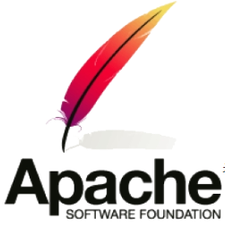
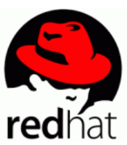
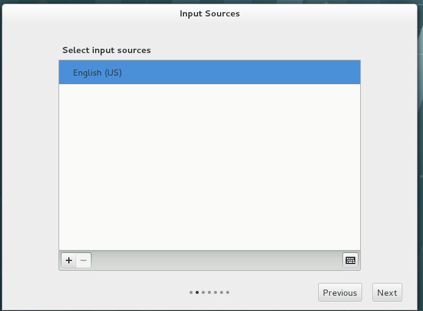

# Linux 学习笔记（一）Linux 简介与环境安装

* 本笔记基于 刘遄 的《Linux 就该这么学》一书。

## Linux 简介

### 书籍前言

* "工作马马虎虎，只想在兴趣和游戏中寻觅快活，充其量只能获得一时的快感，绝不能尝到从心底用处的惊喜和快乐，但来自工作的喜悦并不像糖果那样——放进嘴里就甜味十足，而是需要从苦劳与艰辛中渗出，因此当我们聚精会神，孜孜不倦，克服艰辛后的成就感，世上没有哪种喜悦可以类比。"

### 开源共享

* 对于开源软件，用户具有**使用自由**、**修改自由**、**重新发布自由**以及**创建衍生品的自由**。
* 开源软件的重要特性：**低风险**、**高品质**、**低成本**、**更透明**。

#### 开源许可协议

##### GNU GPL

* GNU General Public License，GNU 通用公共许可证。
* 遵循 GPL 协议的产品或代码，必须开源、免费，因此这个协议并**不适合商用软件**。
* 包括 Linux 系统在内的大多数开源软件都是基于该协议的。
* GPL 开源许可协议最大的 4 个特点：
  * 复制自由：允许软件复制到任何人的电脑中，并不限制复制的数量。
  * 传播自由：允许软件以各种形式进行传播。
  * 收费传播：允许在各种媒介出售该软件，通过为用户提供**有偿服务**的形式盈利。
  * 修改自由：允许增加或删除软件功能。

##### BSD

* Berkeley Software Distribution，伯克利软件发布版许可协议。
* 可以将软件**作为商业软件发布**和销售。
* 需要满足下面3个条件：
  * 如果发布软件中包含源代码，必须遵循 BSD 许可。
  * 如果发布软件中只有二进制程序，则需要声明原始代码遵循了 BSD 协议。
  * 不允许用原始软件的名字、作者名字或机构名称进行市场推广。

##### Apache

* Apache License Version，Apache 许可证版本许可协议。
* 允许用户修改代码和再发布。适用于商业软件。
* 需要满足下面的4个条件：
  * 该软件及其衍生品必须继续使用 Apache 许可协议。
  * 如果修改了程序源代码，需要在文档中进行声明。
  * 若软件基于他人的源代码编写，需要保留原始代码的协议、商标、专利声明和原作者声明。
  * 有声明文件，需标注 Apache 许可协议及其他协议。

##### MPL

* Mozilla Public License，Mozilla 公共许可协议。
* 注重对开发者源代码需求和受益之间的平衡。

##### MIT

* Massachusetts Institude of Technology，MIT 许可协议。
* 限制最少的许可协议，普遍被商业软件所使用。

### 为什么学习 Linux？

#### 历史

* 20世纪70年代：UNIX 系统开源且免费。
* 1979：AT&T 公司对 UNIX 系统的商业化。（不再开源）
* 1984：Richard Stallman 发起 GNU 源代码开发计划，制定了 GPL 许可协议。
* 1987：GNU 计划的重大突破—— gcc 编译器发布。
* 1991.10：芬兰赫尔辛基大学的 Linus Torvalds 编写了一款名为 Linux 的操作系统。
  * 由于较高的代码质量且基于 GNU GPL 许可协议的开源特性，迅速得到了 GNU 计划的一大批黑客程序员支持。
  * 此后 LInux 系统便进入了如火如荼的发展阶段。
* 1994.1：Bob Young 在 Linux 系统内核的基础上，集成了众多的**源代码**和**程序软件**，发布了**红帽系统**并开始出售技术服务。
  * 进一步推动了 Linux 系统的普及。
* 1998年以后：以 IBM 和 Intel 为首的多家 IT 巨头开始大力推动开发源代码软件发展。
* 2017年底，Linux 内核已经发展到 4.13 版本，并且 Linux 系统版本也有数百个之多，但他们都依然使用 Linus Torvalds 开发、维护的 Linux 系统内核。
  * **RedHat** 公司成为了开源行及 Linux 系统的带头公司。

#### Linux 特点

* Linux 系统是一款优秀的软件产品，具有类似 UNIX 的程序界面，并且继承了 UNIX 的稳定性，能够较好地满足工作需求。

##### 对比 Windows

* Windows 系统也确实很优秀，但在**安全性**、**高可用性**与**高性能**方面却难以让人满意。
* Linux 系统相较于 Windows 系统有下列具体优势：
  * 稳定且有效率；
  * 免费或少许费用；
  * 漏洞少且快速修补；
  * 多任务多用户；
  * 更加安全的用户及文件权限策略；
  * 适合小内核程序的嵌入系统；
  * 相对不耗资源。

##### Linux 系统内核与发行套件系统

* Linux 系统内核指的是由 Linus Torvalds 负责维护，提供硬件抽象层、硬盘及文件控制及多任务功能的**系统核心程序**。
* Linux 发行套件系统即 **Linux 操作系统** 是由 Linux 内核与各种常用软件的集合产品。

#### Linux 版本

* 全球大约有数百款 Linux 系统版本，每个系统版本都有自己的特性和目标人群。
* 下面将从用户角度选出最热门的几款进行介绍。

##### RHEL

* RedHat Enterprise Linux，RHEL，红帽企业版 Linux。
* 红帽公司是全球最大的开源技术厂商，RHEL 是全世界内使用**最广泛的** Linux 系统。
* RHEL 系统具有极强的性能与稳定性，在全球范围内拥有完善的技术支持。
* 是本书、红帽认证以及众多生产环境中使用的系统。

##### CentOS

* Community Enterprise Operating System，CentOS，社区企业操作系统。
* 通过把 RHEL 系统重新编译并发布给用户**免费使用**的 Linux 系统，具有广泛的使用人群。
* 目前已被红帽公司"收编"。

##### Fedora

* 由红帽公司发布的**桌面版系统套件**（目前已不限于桌面版）。
* 可免费体验到最新的技术和工具，这些技术和工具成熟后会被加入到 RHEL 系统中。是 RHEL 系统的"试验田"。
* 有利于运维人员多关注 Linux 系统的**发展变化以及新特性**。

##### openSUSE

* 源自**德国**的一款著名的 Linux 系统，在全球范围有着不错的声誉和市场占有率。

##### Gentoo

* 具有极高的**自定制性**，操作复杂，适合**有经验的人员**使用。

##### Debian

* 稳定性、安全性强，提供**免费的基础支持**，良好地支持各种硬件架构。
* 提供近十万种不同的**开源软件**，在国外拥有很高的认可度和使用率。

##### Ubuntu

* 是一款派生自 Debian 的操作系统，对新款硬件具有极强的**兼容能力**，极其出色。
* Ubuntu 也可用于**服务器**领域。

注：

* 许多图书围绕 CentOS 是因为它免费，而它去掉了很多收费的服务套件功能，而且不提供任何形式的技术支持。
* 因此本书使用 RHEL 7 系统编写。内容和实验完全通用于 CentOS、Fedora 等系统。

### 红帽公司系统与认证

#### RHEL 7 系统

##### RHEL 7 是否会成为未来热门的系统？

* 虽然目前 RHEL 7 系统的市场份额依然不温不火，但是 RHEL 7 创新式地集成了 Docker 虚拟化技术，支持 XFS 文件系统，兼容微软的身份管理，并采用 systemd 作为系统初始化进程，其性能和兼容性相较于之前版本都有了很大改善，很明显是一款非常优秀的操作系统。

##### 是否需要改变现有环境，换成该操作系统？

* 升级到 RHEL 7 系统是否有必要的问题：
  * 当工作需求超过了当前版本的能力范围时，就必须要进行升级。
  * 而且相关软件在不同系统中的版本号不同，功能就存在很大差距。
* 不论是学习 Linux 还是编程语言，都应该选择当前稳定且最新的版本作为学习环境。
* **稳定**：无论是开发还是运维，稳定压倒一切；
* **最新**：老版本可能会有更大的概率存在安全漏洞或者功能缺陷，新版本出现漏洞概率更小，即便出现漏洞，也会快速得到修复和解决。

#### 红帽认证

* 红帽认证是由红帽公司推出的 Linux 认证，被认为是 Linux 行业乃至整个 IT 领域价值最高的认证之一。
* 其认证主要包括以下三种：

##### RHCSA

* Red Hat Certified System Administrator，RHCSA，红帽认证系统管理员。
* Linux 系统的初级认证，比较适合 Linux 爱好者。
* 能力：安装和调试 Linux 系统，安全性设施，并连接局域和广域网络。
* 需要完成的任务：
  * 管理文件、目录、文档以及命令行环境；
  * 使用分区、LVM 逻辑卷管理本地存储；
  * 安装、更新、维护、配置系统与核心服务；
  * 熟练创建、修改、删除用户与用户组，并使用LDAP进行集中目录身份认证；
  * 熟练配置防火墙以及 SELinux 来保障系统安全。

##### RHCE

* Red Hat Certified Engineer，RHCE，红帽认证工程师。
* Linux 系统的中级水平认证，难度更大，要求必须已取得 RHCSA 认证，适合有基础的 Linux 运维管理员。
* 需要对下列服务的管理与配置能力：
  * 熟练配置防火墙规则链与 SElinux 安全上下文；
  * 配置 iSCSI（互联网小型计算机系统接口）服务；
  * 编写 Shell 脚本来批量创建用户、自动完成系统的维护任务；
  * 配置 HTTP/HTTPS 网络服务；
  * 配置 FTP 服务；
  * 配置 NFS 服务；
  * 配置 SMB 服务；
  * 配置 SMTP 服务；
  * 配置 SSH 服务；
  * 配置 NTP 服务。

##### RHCA

* Red Hat Certified Architect，RHCA，红帽认证架构师。
* Linux 系统的最高级别认证，是公认的 Linux 操作系统顶级认证，目前中国仅有不到 1000 人持有该认证。难度大。
* 考察的是考生对红帽卫星服务、红帽系统集群、红帽虚拟化、系统性能调优以及红帽云系统的安装搭建与维护能力。

## 部署虚拟环境

* 本节将介绍如何安装虚拟机软件。

### 为什么安装虚拟机？

* 虚拟机是能够让用户在一台真机上模拟出多个操作系统的软件。
  * 无论经济条件是否允许，都不应该在学习期间把 Linux 系统安装到**真机**上，因为学习过程免不了要"**折腾**" Linux 系统。
  * 虚拟机软件能**模拟硬件资源**，分离真机文件与实验环境，保证了**数据安全**。
  * 当**操作失误**或配置有误导致系统异常时，可以**快速还原**至出错前的环境状态，减少重装系统的等待时间。

### VM 虚拟机

* VMware WorkStation 虚拟机软件是一款桌面计算机虚拟软件，用户能够在单一主机上同时运行多个不同的操作系统。
* 每个虚拟操作系统的硬盘分区、数据配置都是**独立**的，而且多台虚拟机可以构建为一个**局域网**。
* Linux 系统对硬件设备的要求很低，课程实验完全用虚拟机就可以搞定。
* VM还支持实时快照、虚拟网络、拖曳文件以及PXE（Preboot Execute Environment，预启动执行环境）网络安装等方便实用的功能。

### 安装步骤

#### 安装 VMware Workstation Pro

* 运行 VMware Workstation 虚拟机安装包，进入安装向导初始界面。

* **问题一**：报错"安装程序无法继续。Microsoft Runtime DLL安装程序未能完成安装。"。
  * **解决方法**：右击我的电脑 -> 管理 -> 服务与应用程序 -> 服务 -> 找到 Windows Installer -> 启动。然后重新打开软件包。
* 点击"下一步"，一路继续，注意选择"增强型键盘驱动程序"，一路安装，直至完成。

#### 激活

* 打开桌面上的 VMware，选择许可证秘钥或试用。这里我选择的是输入激活码。
* 5A02H-AU243-TZJ49-GTC7K-3C61N 该激活码可用。
* 直到打开管理界面，说明激活完成：

#### 配置虚拟机

* 在安装完虚拟机后，不能立即安装 Linux 系统，因为要在虚拟机内设置**操作系统的硬件标准**。VM虚拟机的强大之处在于不仅可以调取真实的**物理设备资源**，还可以模拟出**多网卡或硬盘**等资源，完全可以满足对学习环境的需求。
* 首先点击"创建新的虚拟机"，弹出如下界面：

* 点击下一步，弹出安装客户机操作系统界面，选择"稍后安装操作系统"。
  * 注：不要选择安装程序光盘镜像文件，这样虚拟机会默认装精简的 Linux 系统，不符合实验要求。

* 点击下一步，选择 Linux 操作系统，版本选择 Red Hat Enterprise Linux 7 64位：

* 点击下一步，给虚拟机取个名字，然后设置磁盘大小为 20G（默认）：

* 点击下一步，弹出下面的页面，点击自定义硬件，开始配置：

* 设置内存为 2G，最低不应低于 1G：
  * 即使真机性能很强，也建议设置为 2GB，因为将虚拟机的内存设置太大没有必要。

* 根据真机性能情况设置处理器数量，点选虚拟化功能：
  * 虚拟化 Intel VT-x/EPT 或 AMD-V/RVI(V)
  * 虚拟化 CPU 性能计数器(U)

* 光盘选择 RHEL 的镜像文件：

* 网络适配器，这里选择"仅主机模式"：

* 移除 USB 控制器，声卡，打印机。留下其他的（包括显示器）。然后关闭页面，点击完成，出现以下的页面就建立成功了。

#### 网络模式

* VM 虚拟机为用户提供了 3 种可选的网络模式：
  * **桥接模式：**相当于在物理主机与虚拟机网卡之间架设了一座**桥梁**，从而可以通过物理主机的网卡访问外网。
  * **NAT模式**：让 VM 虚拟机的网络服务发挥路由器的作用，使得通过虚拟机软件模拟的主机可以通过物理主机访问外网，在真机中 NAT 虚拟机网卡对应的物理网卡是 **VMnet8** 。
  * **仅主机模式：**仅让虚拟机内的主机与物理主机通信，不能访问外网，在真机中仅主机模式模拟网卡对应的物理网卡是 **VMnet1** 。

## 安装 Linux 系统

* 虚拟机配置完成后，下一步就可以正式开始 Linux 之旅了。
* 本章将着重介绍如何安装和配置 Linux 系统。

### 配置 VT 技术与虚拟键盘

#### VT 技术

* Virtualization Technology，VT，虚拟化技术。
* 安装 RHEL 7 系统需要 CPU 支持 VT 技术。该技术指的是，让单台计算机能够分割出多个**独立资源区**，并让每个资源区按照需要模拟出系统的一项技术。其本质是通过**中间层**实现计算机资源的管理和再分配，让系统资源的利用率最大化。
* 只要电脑价格不低于 3000 元，它的 CPU 肯定会支持 VT。

#### 配置 VT 技术

* 如果没有启用 VT 技术，开启虚拟机时就会产生如下的错误：

* 启用 VT 技术的方法是：
  * 重启电脑，电脑刚打开的时候按 F10 键（不同的电脑不一样）进入 BIOS 界面，然后选择 System Configuration（系统配置）选项，找到 Virtualization Technology 选项，然后回车键，更改选项为启用 Enable。最后保存关闭，重新启动电脑就可以啦。

#### 启用虚拟键盘

* 笔者开启虚拟机时遇到了如下错误：

* 该问题可以按如下步骤解决：
  * 首先，关闭虚拟机。
  * 然后，点击"编辑虚拟机设置"；
  * 弹出窗口选择"选项"，右下角"增强型键盘"，选择"在可用时使用"。

### Linux 安装程序

#### 安装启动

* 打开虚拟机后，由于已经加载 iso 镜像，会显示如下的界面。界面中有以下三个选项：
  * Install Red Hat Enterprise Linux 7.0 安装 Linux 系统；
  * Test this media & install Red Hat Enterprise Linux 7.0 校验光盘完整性后再安装；
  * Troubleshooting 启动救援模式。
* 通过键盘的方向（上下键）选择第一项，直接安装 Linux 系统：

* 经过一段时间的初始化加载后，打开安装界面。首先选择语言，这里我们选择英语，点击 Continue：

#### 安装配置

* 下面进入的界面是安装的整体信息：

* 首先打开 SOFTWARE SELECTION（软件定制）。该界面可以将 Linux 系统定制称为基础服务器（Infrastructure Server）、文件服务器（File and Print Server）、Web 服务器或工作站（Basic Web Server）等。
* 在这个部分选择 Server with GUI，然后点击 Done：

* 回到主界面，点击 NETWORK & HOSTNAME，将 **Hostname** 进行设置，我们这里设置为 linuxprobe.com。然后点击 Done按钮：

* 回到主界面，点击 INSTALLATION DESTINATION：
  * 该界面用来选择**安装媒介**并**设置分区**。
  * 我们不用修改任何内容，直接点击 Done 即可。

* 回到主界面，此时信息都已配置完毕，点击 Begin Installation 开始安装。

#### 安装过程

* 下面的界面会显示安装进度条，并提示我们完成登录密码设置：

* 点击 ROOT PASSWORD，设置 root 管理员密码。使用弱（weak）口令密码则输入完毕后需要点击两次 Done 按钮，其他情况点击一次就可以。
  * 在虚拟机中做实验时，密码无所谓强弱，
  * 但在生产环境中一定要让 root 管理员的密码足够复杂，否则系统将面临严重的安全问题。

#### 安装完成

* 等待 Linux 系统安装完成（约30~60分钟），安装结束后点击右下角的 Reboot 按钮重启机器。

### Linux 启动初始化

* 首次启动 Linux，需要进行一些必要的初始化工作。点击 LICENSE INFORMATION 选项，选 I accept the license agreement 复选框，点击左上角的 Done 按钮，回到主界面点击 FINISH CONFIGURATION 选项。

* 接下来进入 Kdump 服务界面。如果不需要调试系统内核，可以将 Enable kdump 取消选中，然后点击 Forward 按钮。

* 接下来进入 Subscription Management Registration（系统订阅）界面，选中 No, I prefer to register at a later time. 按钮，然后单击 Finish 按钮。此时不注册系统对后续无影响。

### 欢迎界面

* 此时 Linux 系统会进行又一次的重启。终于看到了欢迎界面。选择默认的语言 English，系统输入来源选择 English(US)，单击 Next 按钮：

* 创建一个普通用户，这里的用户名和密码不是刚刚的 root 口令，自己设置即可。（笔者创建的用户名为 linuxprobe），接着选择时区（笔者选择中国上海），最后出现感谢界面，至此，RHEL 7 系统就完成了全部的安装和部署工作。可以开始使用了。

## 总结与说明

* 本笔记介绍了 Linux 的特性和版本信息，接着详细介绍了 VMware 虚拟机的安装配置和 RHEL 7 的安装配置。
* 本笔记未介绍原书中的重置 root 管理员密码、RPM、Yum 软件仓库和 Systemd 初始化进程等内容。个人认为这部分还有点难度，不是很适合新手去学习和训练。将会在后文学习笔记中追加这部分内容。

* Written by：Sirius. Lu
* Reference：刘遄 《Linux 就该这么学》
* 2020.7.15

