# Linux 学习笔记（三）重定向、三类符号、环境变量

* 本笔记基于 刘遄 的《Linux 就该这么学》一书。
* 本章将首先介绍与文件读写操作有关的重定向技术，然后讲解管道符、通配符、转义符等，最后介绍 Linux 执行命令的内部原理，以及 环境变量。


## 输入输出重定向

### 引言

* 简单来说，输入重定向是指把**文件导入命令**中，而输出重定向是指把原本要输出到**屏幕**的数据信息**写入到指定文件**中。
* 相较于输入重定向，输出重定向的使用频率更高，
  * 因此输出重定向有分为**标准输出重定向**、**错误输出重定向**两种不同技术；
  * 以及**清空写入**与**追加写入**两种模式。


### 不同的输入输出信息

#### 定义

* 标准输入重定向 STDIN：文件描述符为 0，默认从键盘输入，也可从其他文件或命令中输入。
* 标准输出重定向 STDOUT：文件描述符为 1，默认输出到屏幕。
* 错误输出重定向 STDERR：文件描述符为 2，默认输出到屏幕。

#### 不同的输出信息

* 以 ls 为例，展示一个输出正确信息和错误信息的例子：

```shell
touch linuxprobe
ls -l linuxprobe
ls -l xxxxxx
```

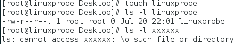

* 上述命令中，由于名为 linuxprobe 的文件存在，输出信息是该文件的一些相关权限、所有者、所属组、文件大小及修改时间等信息，这也是该命令的**标准输出信息**；而名为 xxxxxx 的文件是不存在的，因此显示了报错信息（即错误输出信息）。


### 重定向技术符号

#### 输入重定向符号

* 输入重定向技术用到的符号和作用：

| 符号                 | 作用                                            |
| -------------------- | ----------------------------------------------- |
| 命令 < 文件          | 将文件作为命令的标准输入                        |
| 命令 << 分界符       | 从标准输入中读入，直到遇见分界符才停止          |
| 命令 < 文件1 > 文件2 | 将文件 1 作为命令的标准输入并将标准输出到文件 2 |

#### 输出重定向符号

* 输出重定向技术用到的符号和作用：

| 符号              | 作用                                                         |
| ----------------- | ------------------------------------------------------------ |
| 命令 > 文件       | 将标准输出重定向到一个文件中（清空原有文件的数据）           |
| 命令 2> 文件      | 将错误输出重定向到一个文件中（清空原有文件的数据）           |
| 命令 >> 文件      | 将标准输出重定向到一个文件中（追加到原有内容的后面）         |
| 命令 2>> 文件     | 将错误输出重定向到一个文件中（追加到原有内容的后面）         |
| 命令 >> 文件 2>&1 | 将标准输出与错误输出共同写入到文件中（追加到原有内容的后面） |
| 命令 &>> 文件     | 作用同上                                                     |

* 注意，重定向中的标准输出模式，可以省略文件描述符 1 不写，而错误输出模式的 2 是必须要写的。


### 例子

#### 重定向输出

* 下例将 man bash 命令原本要输出的信息写入到 readme.txt 中：

```shell
man bash > readme.txt
cat readme.txt
```

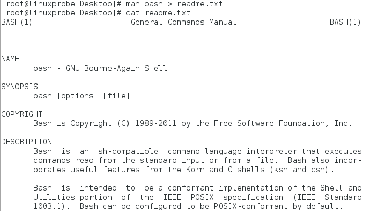

#### 覆盖写、追加写

* 为了展示覆盖写和追加写模式的区别，下面继续对 readme.txt 文件覆盖写入一行信息（覆盖刚刚的 man bash 输出），然后通过追加写入模式向文件写入一次数据：

```shell
echo "Welcome to LinuxProbe.Com" > readme.txt
echo "Quality linux learning materials" >> readme.txt
cat readme.txt
```

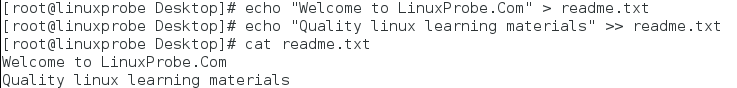

#### 标准输出重定向

* 对于标准输出，如果进行错误输出重定向，那么结果依然会输出到屏幕上：

```shell
ls -l linuxprobe
ls -l linuxprobe > /root/stderr.txt
ls -l linuxprobe 2> /root/stderr.txt
```

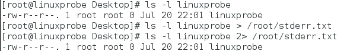

#### 错误输出重定向

* 对于错误输出，如果进行正确输出重定向，结果依然会输出到屏幕上：
  * 当用户执行一个自动化的 Shell 脚本时，这个操作非常有用，因为可以把整个脚本执行过程中的报错信息都记录到文件中。

```shell
ls -l xxxxxx
ls -l xxxxxx > /root/stderr.txt
ls -l xxxxxx 2> /root/stderr.txt
cat /root/stderr.txt
```

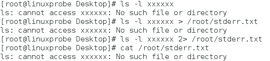

#### 输入重定向

* 输入重定向用的较少一点，把文件直接导入到命令中：

```shell
wc -l readme.txt
```


* 该命令等同于接下来学习的 cat readme.txt | wc -l 的管道符命令组合。


## 管道命令符

### 格式与含义

#### 格式

* 管道符 | 可以通过键盘上 Shift+\ 键来输入，其执行格式为 命令 A | 命令 B。

#### 作用

* 管道符的作用是，把**前一个命令**原本要**输出到屏幕**的标准正常数据当做是**后一个命令的标准输入**。


### 实例

#### 连接实例 1：输出+求行数

* 上一章中曾讲解过用于文本搜索的 grep 命令以及用该命令匹配 /etc/passwd 中用户信息中 /sbin/nologin 内容的代码。
  * （ /sbin/nologin 内容说明该用户被限制登录）
  * 这里先稍微复习一下：

```shell
grep /sbin/nologin /etc/passwd
```

* 接下来通过管道符来解决**返回被限制登录的用户数量**的问题：
  * 该问题可以拆解为以下两个部分：
  * 1、用 grep 命令找出被限制登录用户（同刚刚复习的 grep 命令）
  * 2、统计输出内容的行数（wc -l 命令）

* 因此上述问题可以用管道符加以连接：

```shell
grep /sbin/nologin /etc/passwd | wc -l
```

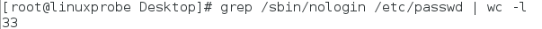

#### 连接实例 2：输出+翻页

* 当一个命令的输出过多时，可以通过管道符添加翻页方法：
  * 比如，用翻页的形式查看 /etc 目录中的文件列表及属性信息：

```shell
ls -l /etc/ | more
```

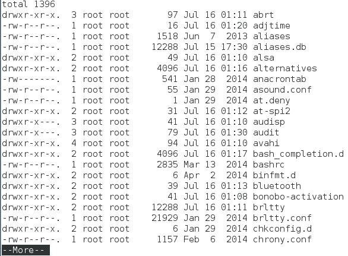

#### 连接实例 3：修改密码+确认

* 修改用户密码时，通常都需要输入两次密码以进行确认，这在编写自动化脚本时会成为一个致命缺陷。
  * 通过将管道符和 passwd 命令的 --stdin 参数相结合，来用一个命令完成密码重置工作：

```shell
echo "linuxprobe" | passwd --stdin root
```

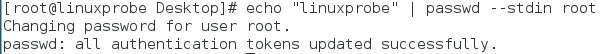

#### 连接实例 4：邮件打包发送

* 发送邮件默认采用交互式的方式来进行；利用管道符可以实现一条命令将标题和内容打包发送：

```shell
echo "Content" | mail -s "Subject" linuxprobe
su - linuxprobe
```

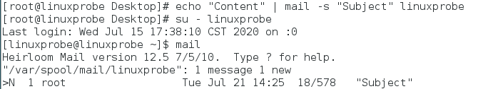

#### 连接实例 5：重定向符做管道

* 管道符还有很多高级的用法，下面一条命令使用 mail 邮件命令和输入重定向让用户一直输入内容，知道 over 结束：

```shell
mail -s "Readme" root@linuxprobe.com << over
```

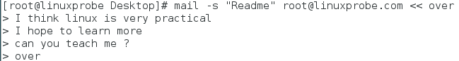


### 总结

* 管道命令符在一个命令组中不是只可以用一次，也完全可以使用：命令 A | 命令 B | 命令 C。
* 管道命令符就好像是"哆啦A梦"里的任意门，多次使用来实现数据穿越，提高了工作效率。


## 命令行的通配符

* 写命令时，常常遇到不记得某个文件或者某一些文件存在相同的一部分名称的情况，此时使用**通配符**来进行匹配就能提高效率。

### 格式与含义

* 通配符就是通用的匹配信息的符号。下面介绍几种通配符的格式和含义：

| 通配符      | 含义                     |
| ----------- | ------------------------ |
| 星号 "*"    | 匹配零个或多个字符       |
| 问号 "?"    | 匹配单个字符             |
| 中括号 "[]" | 匹配中括号内的某单个字符 |

* 中括号内可以有多种形式，比如 "[0-9]" 代表匹配 0~9 之间的任何一个数字，"[135]" 代表匹配 1、3、5 三个字符中的任何一个数字，"[a-z]" 代表匹配字母 a~z 之间的任何一个字母。


### 例子

* 以查看硬盘文件与分区为例，如果我需要查看所有分区，不使用通配符可能要这样做：

```shell
ls -l /dev/sda
ls -l /dev/sda1
ls -l /dev/sda2
```

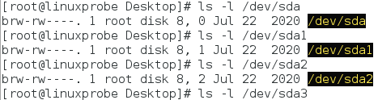

* 使用星号（*）通配符显示所有硬盘分区：

```shell
ls -l /dev/sda*
```

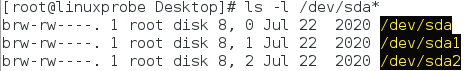

* 使用问号（?）通配符显示 sda 后面含一个字符的硬盘分区：

```shell
ls -l /dev/sda?
```

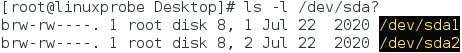

* 使用中括号通配符匹配多个数字中的一个：

```shell
ls -l /dev/sda[0-9]
ls -l /dev/sda[135]
```

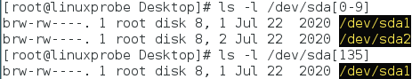


## 常用的转义字符

* Shell 解释器提供了特别丰富的转义字符来处理特殊的输入数据。这里我们只介绍 4 个最常用的转义字符。

### 字符及含义

* 4 个最常用的转义字符如下表所示：

| 转义字符     | 作用                                     |
| ------------ | ---------------------------------------- |
| 反斜杠（\）  | 使反斜杠后面的一个变量变为单纯的字符串。 |
| 单引号（''） | 转义其中所有的变量为单纯的字符串。       |
| 双引号（""） | 保留其中的变量属性，不进行转义处理。     |
| 反引号（``） | 把其中的命令执行后返回结果。             |


### 例子

* 先定义一个变量 PRICE 并赋值为 5，然后输出变量信息：

```shell
PRICE=5
echo "Price is $PRICE"
```

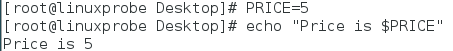

#### 非预期的输出

* 接下来我们希望能够输出"Price is $5"；
  * 但是该字符串中出现了两个"$"符号，作用是显示当前程序的进程 ID 号码，因此输出内容不是所预期的：

```shell
echo "Price is $$PRICE"
```

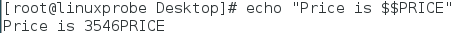

#### 反斜杠转义字符

* 要想让第一个 $ 显示，需要利用反斜杠转义字符：

```shell
echo "Price is \$$Price"
```


#### 反引号转义字符

* 当需要某个命令的输出值时，可以将命令用反引号括起来，达到预期的效果：

```shell
echo `uname -a`
```

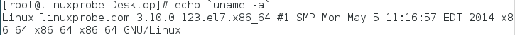


## 重要的环境变量

### 变量与环境变量

* 变量是计算机系统用于**保存可变值的数据类型**。Linux 系统中变量名称一般**大写**，通过变量名称可以提取到对应的变量值。
* 环境变量是用来定义系统运行环境的**一些参数**，比如每个用户不同的家目录、邮件存放位置等。
  * 为保证 Linux 系统正常运行并且为用户提供服务，需要数百个环境变量协同工作，而我们没有必要逐一查看这些变量，而是去学习最重要的环境变量。


### Linux 系统的命令执行步骤

* 在介绍环境变量之前，需要介绍 Linux 系统在执行一个命令的主要步骤：

#### 第 1 步

* 判断用户是否以绝对路径或相对路径的方式输入命令（如 /bin/ls ），如果是的话则直接执行。（否则进行第二步）

#### 第 2 步

* Linux 系统检查用户输入的命令是否为 "别名命令"，即用一个**自定义命令名称**来替换原本的命令名称。
  * 对 alias 和 unalias 命令有一个小例子，我们放在本节最后叙述。

#### 第 3 步

* Bash 解释器判断用户输入的是内部命令还是外部命令。内部命令是解释器内部的指令，会被直接执行；而用户在绝大部分时间输入的是外部命令，这些命令交由下一步处理。
  * 运用 "type 命令名称" 可以判断命令是外部的还是内部的。

#### 第 4 步

* 系统在多个路径中查找用户输入的命令文件，而定义这些路径的变量叫做 PATH，作用是告诉 Bash 解释器待执行的命令可能存放的位置，然后 Bash 解释器在这些位置中逐个查找。


### PATH

* PATH 是由多个路径值组成的变量，每个路径值之间用冒号间隔，对这些路径的增加和删除操作将影响到 Bash 解释器对 Linux 命令的查找。

#### 检查 PATH 变量

* 用下面的命令检查 PATH 变量：

```shell
echo $PATH
```


#### 增加 PATH 变量

* 用下面的命令增加 PATH 内容：

```shell
PATH=$PATH:/root/bin
echo $PATH
```

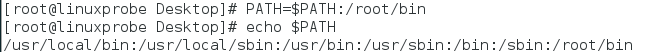

#### 问题

* 这里有一个重要的问题：为什么不能把当前目录（.）添加到 PATH 中呢？
  * 将其添加到 PATH 变量中可以让用户免去输入命令路径的麻烦。
* 但是，如果黑客在比较常用的公共目录 /tmp 中存放了一个与 ls 或 cd 命令同名的木马文件，而用户又恰巧在公共目录中执行了这些命令，那么就极有可能中招了。
* 因此，接手一台 Linux 系统后一定会在执行命令前先检查 PATH 变量中是否有可疑的目录。使用 env 命令来查看到 Linux 系统中所有的环境变量。


### 10 个重要的环境变量

* 接下来我们介绍 Linux 系统中的 10 个最重要的环境变量：

| 环境变量名   | 作用                             |
| ------------ | -------------------------------- |
| HOME         | 用户的主目录（即家目录）         |
| SHELL        | 用户在使用的 Shell 解释器名称    |
| HISTSIZE     | 输出的历史命令记录条数           |
| HISTFILESIZE | 保存的历史命令记录条数           |
| MAIL         | 邮件保存路径                     |
| LANG         | 系统语言、语系名称               |
| RANDOM       | 生成一个随机数字                 |
| PS1          | Bash 解释器的提示符              |
| PATH         | 定义解释器搜索用户执行命令的路径 |
| EDITOR       | 用户默认的文本编辑器             |


### 变量的用法与例子

#### 不同用户不同变量

* Linux 作为一个多用户多任务的操作系统，能够为每个用户提供独立的、合适的工作运行环境：
  * 因此，一个相同的变量会因为用户身份的不同而具有不同的值。
* 下面的命令查看 HOME 变量在不同用户下都有哪些值：

```shell
echo $HOME
su - linuxprobe
echo $HOME
```

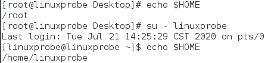

#### 自行创建变量

* 由于变量是由固定的变量名与用户或系统设置的变量值两部分组成，我们也可以自行创建变量，来满足工作需求。
* 下面的例子创建一个名称为 **WORKDIR** 的变量，方便用户更轻松地进入一个层次更深的目录：

```shell
mkdir /home/workdir
WORKDIR=/home/workdir
cd $WORKDIR
pwd
```

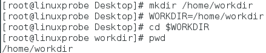

#### 全局变量

* 但是，上述变量不具有全局性，作用范围有限，默认情况下不能被其他用户使用。如果工作需要，可以使用 export 命令将其提升为**全局变量**，以供其他用户使用：

```shell
su linuxprobe
cd $WORKDIR
echo $WORKDIR
exit
export WORKDIR
su linuxprobe
cd $WORKDIR
pwd
```

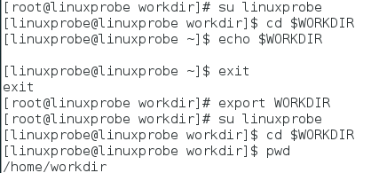


### 别名命令

* 用 alias 命令可以创建一个属于自己的命令别名，格式为 "alias 别名=命令"。
* 用 unalias 命令可以取消一个命令别名，格式为 "unalias 别名"。

#### 例子

* rm 命令删除文件时，Linux 系统会要求我们确认是否执行删除操作，这其实就是 Linux 系统用于防止用户误删除文件而特意设置的 rm 别名命令。
* 下面我们把它取消掉：

```shell
ls
rm a
alias rm
unalias rm
rm b
```

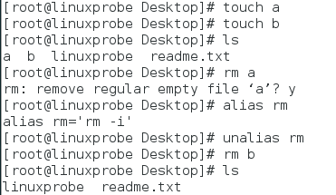

* 以上就是环境变量的全部内容了。


## 总结与说明

* 本章详细介绍了重定向、管道符、通配符、转义符以及环境变量。接下来我们进入 Vim 编辑器和 Shell 命令脚本的学习。


* Written by：Sirius. Lu
* Reference：刘遄 《Linux 就该这么学》
* 2020.7.22


