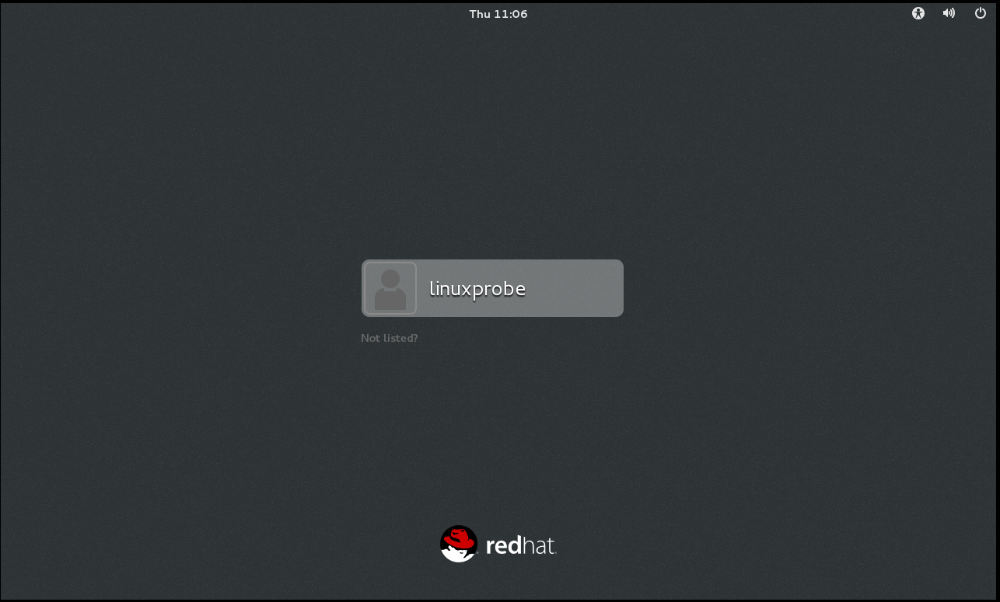

# Linux 学习笔记（二）基本 Linux 命令

* 本笔记基于 刘遄 的《Linux 就该这么学》一书。
* 本章将首先介绍系统内核与 Shell 终端的关系和作用，然后介绍 Bash 解释器的四大优势。
* 在本章学习完毕后，建议浏览下面的网页继续学习 Linux 命令：
  * [https://www.linuxcool.com](https://www.linuxcool.com/)


## Shell 简介

### 为什么要使用 Shell？

#### 系统内核

* 众所周知，计算机硬件是由运算器、控制器、存储器、输入/输出设备等共同组成的，而让各种硬件设备**各司其职**又**协同运行**的东西就是系统内核。
* Linux 系统内核负责完成硬件资源的分配和调度等管理任务。
* 由此可见，系统内核对于计算机的正常运行时十分重要的，因此不建议去**直接编辑**内核参数，而是让用户通过基于**系统调用接口**开发出的**程序和服务**来管理计算机，以满足日常工作的需要。


#### 图形化工具的不足

* Linux 中的很多**图形化工具**（比如逻辑卷管理器[ Logical Volumn Manager，LVM ]）确实非常好用，极大地降低了运维人员操作出错的概率，值得称赞。
* 但是，很多图形化工具其实是调用了**脚本**来完成相应的工作，往往只是为了完成某种工作而设计的，缺乏Linux命令原有的**灵活性**及**可控性**。而且图形化工具相较于 Linux 命令行界面更加**消耗系统资源**，因此经验丰富的运维人员甚至都不会给 Linux 系统**安装图形界面**，需要开始运维工作时直接通过**命令行模式远程连接**过去，不得不说这样做确实挺高效的。


### Shell 终端与 Bash 解释器

* Shell，也称为**终端**或**壳**，就是一种命令行工具，充当的是人与内核之间的翻译官，用户把一些命令"告诉"终端，它再调用一些程序和服务来完成某些工作。
* Bourne-Again SHell，Bash，是一种解释器（终端），也是现在包括红帽系统在内的许多主流 Linux 系统默认使用该终端。
* 选择 Bash 解释器作为命令行终端主要由如下 4 项优势：
  * 上下方向键来调取**历史执行**的 Linux 命令；
  * 命令或参数仅需输入前几位就可以用 **Tab 键**补全；
  * 具有强大的**批处理脚本**；
  * 具有实用的**环境变量**功能。
* 具备一定工作经验以后，才能领悟 Linux 命令的奥秘。


### 打开命令行

* 开启虚拟机，如果进入蓝色锁屏界面，上拉即可进入登录界面。我们不能直接登录普通用户 linuxprobe，而是用管理员登录。
* 点击 Not listed? 按键，弹出对话框，输入用户名（root），以及安装时的管理员登录密码。即可以管理员身份运行。



* 进入主界面，在桌面上右键，选择 Open in Terminal。这样就打开了一个 Shell 窗口：


* 接着就可以开始输入命令了，下面是输入了 man man 命令：


## 查看帮助命令

* 如何和 Bash 好好沟通是最重要的问题。
* 要想准确、高效地完成任务，除了依赖于命令本身，还应该根据实际情况**灵活调整各种命令的参数**。

### Linux 命令格式

* 常见执行 Linux 命令的格式是这样的：

  * 命令名称 【命令参数】 【命令对象】
  * 注意，命令名称、命令参数、命令对象之前请用空格键分隔。
* 命令对象：要处理的文件、目录、用户等资源；
* 命令参数：可以用**长格式**，也可以用**短格式**：

  * 若用长格式（完整的选项名称），用 -- 作为前缀；
  * 若用短格式（单个字母的缩写），用 - 作为前缀。
* Linux 新手不会执行命令是因为参数比较复杂，参数值需要随不同的命令和需求情况而发生改变。灵活搭配参数需要长时间的积累。

```shell
man --help # 长格式
man -h # 短格式
```

 

### man 命令

* 以 man 命令为第一个例子来介绍。man 命令是用来查看帮助文本的命令。
* 举一个 man 命令的小例子，输入 "man man"，即可得到 man 命令本身的帮助文本：


### 帮助信息常用操作按键

* 列举了一些按键的用途：

|   按键    |                用途                 |
| :-------: | :---------------------------------: |
|   space   |             向下翻一页              |
| Page down |             向下翻一页              |
|  Page up  |             向上翻一页              |
|   home    |            直接前往首页             |
|    end    |            直接前往尾页             |
|     /     | 从上至下搜索某个关键词，如 "/linux" |
|     ?     | 从下至上搜索某个关键词，如 "?linux" |
|     n     |     定位到下一个搜索到的关键词      |
|     N     |     定位到上一个搜索到的关键词      |
|     q     |            退出帮助文档             |


### 帮助信息结构与意义

* 一般帮助信息会很长很多，如果不了解目录结构，会难以及时找到需要的信息。

|  结构名称   |        代表的意义        |
| :---------: | :----------------------: |
|    NAME     |           名称           |
|  SYNOPSIS   |    参数的大致使用方法    |
| DESCRIPTION |         介绍说明         |
|  EXAMPLES   | 例子演示（附带简单说明） |
|  OVERVIEW   |           概述           |
|  DEFAULTS   |        默认的功能        |
|   OPTIONS   | 具体的可用选项（带介绍） |
| ENVIRONMENT |         环境变量         |
|    FILES    |        用到的文件        |
|  SEE ALSO   |         相关资料         |
|   HISTORY   |    维护历史与联系方式    |


## 常用系统工作命令

* 下面介绍几个常用的系统工作命令。其他命令将随着后面的章节学习进行介绍。

### echo 命令

* echo 命令用于在终端输出**字符串**或**变量**提取后的值。

#### 格式

* echo [字符串 | $变量]

#### 例子

* 把**字符串** "Linuxprobe.com" 输出到终端屏幕的命令：

```shell
echo linuxprobe.com
# 输出：linuxprobe.com
```

* 使用 $ 方式提取**变量** SHELL 的值，并将其输出到屏幕上：

```shell
echo $SHELL
# 输出：/bin/bash
```


### date 命令

* date 命令用于**显示**和**设置**系统的**时间或日期**。

#### 格式

* date [选项] [+指定的格式]

#### 用法

* 在 date 命令中输入以 "+" 开头的参数，可按照指定的格式来输出系统的时间或日期。
* 在日常工作时可以把**备份数据的命令**与**指定格式输出的时间信息**结合，
  * 例如，可按照将文件 "年-月-日" 打包成 "backup-2017-9-1.tar.gz"，用户只要看一眼文件名称就能大概了解到文件的备份时间。

#### 参数

* date 命令中常见的参数格式及作用如表所示：

| 参数 |      作用      |
| :--: | :------------: |
|  %t  |  跳格[Tab 键]  |
|  %H  | 小时（00~23）  |
|  %I  | 小时（00~12）  |
|  %M  | 分钟（00~59）  |
|  %S  |  秒（00~59）   |
|  %j  | 今年中的第几天 |

#### 例子

* 用**默认格式**查看当前系统时间：

```shell
date
# Thu Jul 16 17:09:36 CST 2020
```

* 按照 "年-月-日  小时:分钟:秒" 格式查看当前系统时间：

```shell
date "+%Y-%m-%d %H:%M:%S"
# 2020-07-16 17:10:15
```

* 将系统的当前时间设置为 2017 年 9 月 1 日 8 点 30 分：

```shell
date -s "20170901 8:30:00"
# Fri Sep  1 08:30:00 CST 2017
```

* 重新查看当前系统时间：

```shell
date
# Fri Sep  1 08:30:06 CST 2017
```

* 查看今天是当年的第几天（这个参数能很好地区分备份时间的新旧，数字越大越靠近当前时间）：

```shell
date "+%j"
# 244
```


### reboot 命令

* reboot 命令用于重启系统，其格式直接输入 reboot 即可。
* 重启计算器这种操作会涉及硬件资源的管理权限，因此默认**只有 root 管理员**来重启。


### poweroff 命令

* poweroff 命令用于关闭系统，其格式直接输入 poweroff 即可。
* 关闭电脑这种操作会涉及硬件资源的管理权限，因此默认**只有 root 管理员**来重启。


### wget 命令

* wget 命令用于在终端中下载网络文件。

#### 注意

* 该函数在目前未完成网络配置的时候无法进行该实验操作。等后面学完网卡的配置章节后再来进行实验。

#### 格式

* wget [参数] 下载地址

#### 参数

* wget 命令的参数如下：

| 参数 |                 作用                 |
| :--: | :----------------------------------: |
|  -b  |             后台下载模式             |
|  -P  |            下载到指定目录            |
|  -t  |             最大尝试次数             |
|  -c  |               断点续传               |
|  -p  | 下载页面内所有资源，包括图片、视频等 |
|  -r  |               递归下载               |

#### 例子

* 本节中的例子没有实验结果，因为尚未配置网卡。
* 下载《linux 就该这么学》的电子文档：

```shell
wget http://www.linuxprobe.com/docs/LinuxProbe.pdf
```

* 递归下载 www.linuxprobe.com 网站内的所有页面数据以及文件：

```shell
wget -r -p http://www.linuxprobe.com
```


### ps 命令

* ps 命令用于查看系统中的进程状态。

#### 格式

* ps [参数]

#### 用法

* ps 命令会产生很多的输出值；
* 通常会将 ps 命令与第 3 章的管道符技术搭配使用，用来抓取与某个指定服务进程相对应的 PID 号码。

#### 参数

* ps 命令的常见参数以及作用如下：

| 参数 |                作用                |
| :--: | :--------------------------------: |
|  -a  | 显示所有进程（包括其他用户的进程） |
|  -u  |        用户以及其他详细信息        |
|  -x  |       显示没有控制终端的进程       |

#### 进程状态

* Linux 系统中时刻运行着许多进程，如果能够合理管理它们，就可以优化系统性能。
* 在 Linux 系统中，有 5 种常见的状态：
  * R（运行）：进程**正在运行**或**在队列中等待**。
  * S（中断）：进程处于**休眠**中，当某**条件形成**后或者**接收到信号**时，则脱离该状态。
  * D（不可中断）：进程**不响应**系统**异步信号**，即便用 kill 命令也**不能将其中断**。
  * Z（僵死）：进程**已经终止**，但进程**描述符**依然存在，直到**父进程调用 wait4() 系统函数**后将进程释放。
  * T（停止）：进程收到**停止信号**后**停止运行**。

#### 重要实例

* **ps aux** 可以查看所有进程状态信息：
  * 需要注意，在 Linux 系统中短格式是可以合并的，合并后保留一个 "-" 号即可。
  * 另外，ps 命令可允许参数不加 "-" 号，因此可直接写成 ps aux 的样子。

```shell
ps aux
# 下面是输出：
USER        PID %CPU %MEM    VSZ   RSS TTY      STAT START   TIME COMMAND
root          1  1.3  0.4  53672  7604 ?        Ss   22:08   0:02 /usr/lib/syste
root          2  0.0  0.0      0     0 ?        S    22:08   0:00 [kthreadd]
root          3  0.1  0.0      0     0 ?        S    22:08   0:00 [ksoftirqd/0]
root          4  0.0  0.0      0     0 ?        S    22:08   0:00 [kworker/0:0]
root          5  0.0  0.0      0     0 ?        S<   22:08   0:00 [kworker/0:0H]
root          6  0.0  0.0      0     0 ?        S    22:08   0:00 [kworker/u256:
root          7  0.1  0.0      0     0 ?        S    22:08   0:00 [migration/0]
root          8  0.0  0.0      0     0 ?        S    22:08   0:00 [rcu_bh]
...后面的省略不表
```

#### 各列输出值的含义

* 有必要了解一下各个列输出值的含义：

|  列名   |            含义            |
| :-----: | :------------------------: |
|  USER   |        进程的所有者        |
|   PID   |         进程 ID 号         |
|  %CPU   |        运算器占用率        |
|  %MEM   |         内存占用率         |
|   VSZ   |  虚拟内存使用量（单位KB）  |
|   RSS   | 占用的固定内存量（单位KB） |
|   TTY   |          所在终端          |
|  STAT   |          进程状态          |
|  START  |        被启动的时间        |
|  TIME   |    实际使用 CPU 的时间     |
| COMMAND |       命令名称与参数       |

