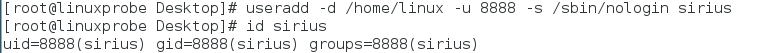
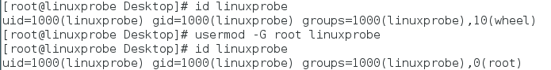
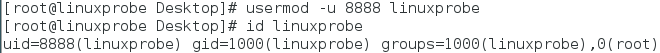
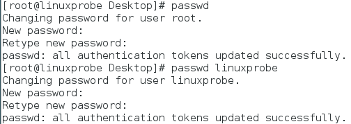
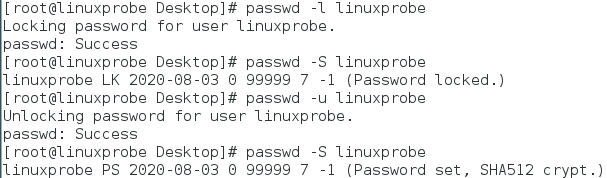
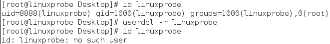
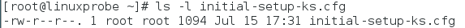

# Linux 学习笔记（五）用户身份与文件权限

* 本笔记基于 刘遄 的《Linux 就该这么学》一书。
* 本章的主要内容将在最后总结。


## 用户身份与能力

* Linux 的设计初衷是满足多个用户同时工作的需求，因此 Linux 必须具备很好的安全性。
* root 是管理员，也是存在于所有类 UNIX 系统中的超级用户。它拥有最高的系统所有权，能管理系统所有功能，如添加/删除用户、启动/关闭服务进程、开启/禁用硬件设备等。
* 但 root 管理员的工作不受到系统的限制，因此执行了错误的命令可能直接毁掉整个系统。
* 这里我们依然希望直接以管理员身份进行学习更好，因为可以刚好地知道错误。


### 用户身份——UID

* 错误的结论：管理员就是 root。
* 管理员之所以是 root，并不是因为名字是 root，而是用户的身份号码（User IDentification，UID）的数值为 0。
* 用户身份有以下这些：
  * UID 为 0：系统的管理员用户。
  * UID 为 1~999：系统用户，Linux 系统为了避免因某个服务程序出现漏洞而被黑客提权至整台服务器，默认服务程序会有独立的系统用户负责运行，进而有效控制被破坏范围。
  * UID 为 1000 以上：普通用户，由管理员创建的用于日常工作的用户。
* 需要注意，UID 是不能冲突的，且即使有闲置号码，管理员创建的普通用户的 UID 也默认从 1000 开始。

#### 用户组

* 为了方便管理，Linux 还提供了用户组的概念。通过使用用户组号码（Group IDentification，GID），可把多个用户加入到同一组中，从而方便为组中的用户统一规划权限或指定任务。
  * 如公司有多个部门，每个部门有很多员工。则会指定让某个部门的员工只能访问这个部门的资源。
* 在创建用户时，Linux 系统将自动创建与其同名的基本用户组，而基本用户组只有该用户一个人。如果该用户之后被纳入其他用户组，则这个其他用户组称之为扩展用户组。一个用户只有一个基本用户组，但是可以有多个扩展用户组。


### useradd 命令

* useradd 命令用于创建新的用户。

#### 格式与用法

* useradd [选项] 用户名
* 创建用户时，默认的用户家目录会被存放在 /home 目录中，默认的 Shell 解释器为 /bin/bash，而且默认会创建一个与该用户同名的基本用户组。

#### 参数

* 可以通过参数来修改设置：

| 参数 | 作用                                      |
| ---- | ----------------------------------------- |
| -d   | 指定用户的家目录（默认为 /home/username） |
| -e   | 账户的到期时间，格式为 YYYY-MM-DD         |
| -u   | 指定该用户的默认 UID                      |
| -g   | 指定一个初始的基本用户组（必须已存在）    |
| -G   | 指定一个或多个扩展用户组                  |
| -N   | 不创建与用户同名的基本用户组              |
| -s   | 指定该用户的默认 Shell 解释器             |

#### 例子

* 下例创建一个普通用户并指定家目录的路径、用户的 UID 以及 Shell 解释器。
  * 请注意，/sbin/nologin 是一种终端解释器，与 Bash 解释器有天壤之别。一旦将用户的解释器设置为 nologin，则该用户不能登录到系统中。

```shell
useradd -d /home/linux -u 8888 -s /sbin/nologin linuxprobe
id linuxprobe
```




### groupadd 命令

* groupadd 命令用于创建用户组。

#### 格式

* groupadd [选项] 群组名

#### 用法

* 工作中常常把几个用户加入到同一个组里面，这样可以针对一类用户统一安排权限。
* 下面是一个创建 ronny 用户组的例子：

```shell
groupadd ronny
```


### usermod 命令

* usermod 命令用于修改用户属性。

#### 格式与用法

* usermod [选项] 用户名
* 由于在系统中创建用户也是修改配置文件的过程，信息保存在 /etc/passwd 文件中，可直接用文本编辑器来修改用户参数数目，
* 也可以用 usermod 命令也可以修改用户信息，诸如用户的 UID、基本/扩展用户组、默认终端等。

#### 参数

* usermod 命令的参数及作用：

| 参数  | 作用                                                         |
| ----- | ------------------------------------------------------------ |
| -c    | 填写用户账户的备注信息                                       |
| -d -m | 参数 -m 与参数 -d 连用，可重新指定用户的家目录并自动把旧的数据转移过去 |
| -e    | 账户的到期时间，格式为 YYYY-MM-DD                            |
| -g    | 变更所属用户组                                               |
| -G    | 变更扩展用户组                                               |
| -L    | 锁定用户禁止其登录系统                                       |
| -U    | 解锁用户，允许其登录系统                                     |
| -s    | 变更默认终端                                                 |
| -u    | 修改用户的 UID                                               |

#### 例子

* 查看账户 linuxprobe 的默认信息：

```shell
id linuxprobe
```

* 将用户 linuxprobe 加入到 root 用户组中，这样扩展组列表中会出现 root 用户组：

```shell
usermod -G root linuxprobe
id linuxprobe
```



* 下面用 -u 参数修改 linuxprobe 的 UID 号码值。
  * 还可以用 -g 参数修改用户的基本组 ID，用 -G 参数修改用户扩展组 ID。

```shell
usermod -u 8888 linuxprobe
id linuxprobe
```




### passwd 命令

* passwd 命令用于修改用户密码、过期时间、认证信息等。

#### 格式与用法

* passwd [选项] [用户名]
* **普通用户**只能使用 passwd 命令修改自身的系统密码，而 root 管理员则**有权限修改其他所有人的密码**。更酷的是，root 管理员在Linux系统中修改自己或他人的密码时**不需要验证旧密码**，这一点特别方便。
* 既然 root 管理员可以修改其他用户的密码，就表示完全拥有该用户的管理权限。

#### 参数

* passwd 命令的参数及作用如下：

| 参数    | 作用                                                         |
| ------- | ------------------------------------------------------------ |
| -l      | 锁定用户，禁止其登录                                         |
| -u      | 解除锁定，允许用户登录                                       |
| --stdin | 允许通过标准输入修改用户密码，如 echo "NewPassWord" \| passwd --stdin Username |
| -d      | 使该用户可用空密码登录系统                                   |
| -e      | 强制用户在下次登录时修改密码                                 |
| -S      | 显示用户的密码是否被锁定，以及密码所采用的加密算法名称       |

#### 例子

* 下面演示如何修改用户自己的密码，以及如何修改其他人的密码（需要 root 权限）：

```shell
passwd # 修改root密码
# 输入密码值
# 再次输入确认
passwd linuxprobe
# 输入密码值
# 再次输入确认
```



* 如果某用户长期不登录，可以使用 passwd 命令禁止用户登录系统，而不是删除。

```shell
passwd -l linuxprobe
passwd -S linuxprobe
passwd -u linuxprobe
passwd -S linuxprobe
```




### userdel 命令

* userdel 命令用于删除用户。

#### 格式与用法

* userdel [选项] 用户名
* 通过userdel命令删除该用户的所有信息。在执行删除操作时，该用户的**家目录默认会保留**下来，此时可以使用 -r 参数将其删除。

#### 参数

* userdel 命令参数如下所示：

| 参数 | 作用                     |
| ---- | ------------------------ |
| -f   | 强制删除用户             |
| -r   | 同时删除用户及用户家目录 |

#### 例子

* 使用 userdel 命令将 linuxprobe 用户删除：

```shell
id linuxprobe
userdel -r linuxprobe
id linuxprobe
```




## 文件权限与归属

### 文件类型与权限简介

#### 文件类型

* 尽管在 Linux 系统中一切都是文件，但是每个文件的类型不尽相同：
  * 因此 Linux 系统使用了不同的字符来加以区分，常见的字符如下所示。

| 字符 | 文件类型     |
| ---- | ------------ |
| -    | 普通文件     |
| d    | 目录文件     |
| l    | 链接文件     |
| b    | 块设备文件   |
| c    | 字符设备文件 |
| p    | 管道文件     |

#### 文件权限

* 在 Linux 系统中，每个文件都有所属的所有者和所有组，并且规定了文件的所有者、所有组以及其他人对文件所拥有的**可读**（r）、**可写**（w）、**可执行**（x）等权限。
* 对一般文件来说：
  * “可读” 表示能够读取文件的实际内容；
  * “可写” 表示能够编辑、新增、修改、删除文件的实际内容；
  * “可执行” 表示能够运行一个脚本程序。
* 重点：而对于目录文件来说：
  * “可读” 表示能够读取目录内的文件列表；
  * “可写” 表示能够在目录内新增、删除、重命名文件；
  * “可执行” 则表示能够进入该目录。


### 文件权限的表示

* 文件的读、写、执行权限可以简写为 rwx，亦可分别用数字 421 表示。
* 文件**所有者**，**所属组**及**其他用户**权限之间**无关联**。

#### 权限表示法

* 文件的权限表示分三个部分的权限，**从前往后**分别是：文件所有者、文件所属组、其他用户。
* 文件权限的数字法表示基于字符表示（rwx）的权限计算而来，其目的是简化权限的表示。
* 例如，若某个文件的权限为 **7** 则代表可读、可写、可执行（4+2+1）。
* 又例如，现在有这样一个文件，其所有者拥有**可读、可写、可执行**的权限，其文件所属组拥有**可读、可写**的权限；而且其他人只有**可读**的权限。那么，这个文件的权限就是 **rwxrw-r--**，数字法表示即为 **764**。由于这三者之间没有互通关系，所以不能写成 17。

#### 分析文件信息

* 下面分析下图所示的文件信息：

```shell
ls -l initial-setup-ks.cfg
```



下面对文件显示的信息作出分析：

* -rw-r--r-- ：开头的 "-" 号表示文件类型为普通文件，后面是访问权限（对应数字是644）。
* 1：文件数。
* root：所有者（属主）。
* root：所属组（输组）。
* 1094：占用的磁盘大小。
* Jul 15 17:31 ：修改时间。
* initial-setup-ks.cfg ：文件名称。


## 文件的特殊权限

* 实际生产过程中，单纯设置 rwx 权限无法满足对安全和灵活性的需求，因此便有了 SUID、SGID 和 SBIT 三种特殊权限位。
* 这些特殊权限与一般权限同时使用，以弥补一般权限不能实现的功能。

### SUID

* SUID 是一种对二进制程序设置的特殊权限，可让二进制程序的执行者临时拥有属主的权限。
  * （仅对拥有执行权限的二进制程序有效）。
* 例如，所有用户都可以执行 passwd 命令来修改自己的用户密码，而用户密码保存在 /etc/shadow 文件中，但该文件的默认权限是 000，那么除了 root 管理员以外，所有用户都没有查看或编辑该文件的权限。但如果使用 passwd 命令时如果加上 SUID 特殊权限位，就可以让普通用户临时获得程序所有者的身份。

#### 特征

* SUID 权限的**直接特征**是权限表示法中**第一部分**（所有者的权限）的**最后一位**变成 **s** 或 **S**。
* 下面说明什么样的情况属于加了 SUID 权限：
* 查看属性时，所有者的权限由 rwx 变成了 rws，这就意味着文件被赋予了 SUID 权限；
* 查看属性时，如果原本的权限是 rw- ，会编程 rwS，意味着文件被赋予了 SUID 权限。

#### 例子

```shell
ls -l /etc/shadow
ls -l /bin/passwd
```

[]


### SGID

* SGID 主要实现如下两种功能：
* 让执行者临时拥有属组的权限（对拥有执行权限的二进制程序进行设置）；
* 在某个目录中创建的文件自动继承该目录的用户组（只可以对目录进行设置）。

#### 属组权限

* SGID 的第一种功能是参考 SUID 设计的，不同点在于不仅获得文件所有者权限，还有属组权限。
* 与 SUID 类似，SGID 权限的最直接特征是权限表示法中**第二部分**（所属组的权限）的**最后一位**变成 **s** 或 **S**。
* 例如，在早期的 Linux 系统中，/dev/kmem 是一个字符设备文件，用于存储内核程序要访问的数据，权限为：

```shell
ls -l /dev/kmem
```

[]

* 上述结果说明除了 root 和属于 system 组成员外，其他用户没有读取权限。
* 由于平时需要查看系统进程状态，为获取进程的状态信息，需要使用 ps 命令：
  * 下面查看 ps 命令文件上的 SGID 特殊权限位：

```shell
ls -l ps
```

[]

* 正是因为 ps 命令被增加了 SGID 位因此执行时临时获取到了 system 用户组权限。

#### 自动继承用户组

* 下面介绍 SGID 的第二个作用。当创建或传送一个文件时，这个文件会自动归属于执行这个操作的用户。
* 当为一个共享目录中设置一个 SGID 权限位后，所有用户在里面创建的任何文件都会归属于该目录的所属组，而不再是自己的基本用户组。这就是 SGID 的第二个功能。
* 下面为举例：

```shell
cd /tmp
mkdir testdir
ls -ald testdir/
chmod -Rf 777 testdir/
chmod -Rf g+s testdir/
ls -ald testdir/
```

[]

* 上例先设置了目录的 777 权限（确保普通用户可以写入），并为该目录设置了 SGID 特殊权限位，这样切换到普通用户就能创建文件。而且该文件会继承新文件所在目录的所属组名称：

```shell
su - linuxprobe
cd /tmp/testdir/
echo "linuxprobe.com" > test
ls -al test
```

[]

#### 补充命令介绍：chmod

* chmod 命令用于设置文件或目录的权限。
* 格式：chmod [参数] 权限 文件或目录名称
* 权限可以用数字表示法，如 rwxrw----，写成数字是 760。

```shell
ls -al test
chmod 760 test
ls -l test
```

[]

#### 补充命令介绍：chown

* chown 命令用于设置文件或目录的所有者或所属组。
* 格式：chown [参数] 所有者:所属组 文件或目录名称
* 该命令和上述命令都可以在操作时加上大写参数 -R 来表示递归操作，这样对文件进行整体操作。

```shell
ls -l test
chown root:bin test
ls -l test
```

[]


### SBIT

* SBIT 特殊权限位可确保用户只能删除自己的文件，而不能删除其他用户的文件。
* 换句话说，当对某个目录设置 SBIT 粘滞位（Sticky Bit）权限后，那么该目录中的文件就只能被其所有者执行删除操作。
* RHEL 7 系统中的 /tmp 就是一个共享文件目录，由于设置了 SBIT 特殊权限位，除非是该目录的所有者，否则无法执行删除操作。
* 和 SUID 和 SGID 类似，SBIT 权限会将权限表示位中**第三部分**的**最后一位**修改成 **t** 或 **T**。
* 下面是设置的例子：

```shell
su - linuxprobe
ls -ald /tmp
cd /tmp
ls -ald
echo "Welcome to linuxprobe.com" > test
chmod 777 test
ls -al test
```

[]

* 其实文件是否被删除并不取决于自身权限，而是所在目录是否有写入权限。
* 上述我们将 test 文件赋予 777 权限，但是由于 SBIT 的缘故，依然无法删除该文件：

```shell
su - blackshield
cd /tmp
rm -f test
```

[]

* 若需要对目录设置 SBIT 特殊权限位，只要用 chmod 命令即可。对应参数 o+t 代表设置 SBIT 粘滞位权限：

```shell
exit
cd ~
mkdir linux
cdmod -R o+t linux/
ls -ld linux/
```

[]


## 文件的隐藏属性