# Linux 学习笔记（四）Vim 编辑器与 Shell 命令脚本

* 本笔记基于 刘遄 的《Linux 就该这么学》一书。
* 本章将首先介绍。。。正在制作中。
* 需要注意，本笔记排版与原书的介绍顺序有所不同，会将**理论内容放在前面**讲解，**纯实践内容放在最后**。
  * 当理论内容介绍完毕，笔记会加以注释参看相关实践内容。


## Vim 文本编辑器

* 在 Linux 系统中一切都是文件，而配置一个服务就是在**修改其配置文件的参数**。
* 在日常工作中也免不了要编写文件，这些工作都是通过**文本编辑器**完成的。
* 选择使用 Vim 文本编辑器来完成，它默认安装在所有的 Linux 系统上，是一款超棒的文本编辑器。
* 下面我们边介绍 Vim 编辑器的用法，边体会 Vim 编辑器的特色。


### 三种模式

* Vim 编辑器设置了三种模式——命令模式、末行模式和编辑模式。每种模式也支持多种不同的快捷键，可实现高效操作文本。

#### 模式作用

* 命令模式：控制光标移动，可对文本进行复制、粘贴、删除和查找等工作。
* 输入模式：正常的文本录入。
* 末行模式：保存或退出文档，以及设置编辑环境。

#### 模式切换

* 每次运行 Vim 文本编辑器时，**默认进入命令模式**。输入模式和末行模式都必须通过命令模式进入（换句话说，不能直接从输入模式到末行模式，也不能直接从末行模式到输入模式）。
* 出命令模式：按 a, i, o 等键可进入输入模式，按 : 键可进入末行模式。
* 返回命令模式：无论出于哪个模式，按 Esc 键即返回命令模式。
* 可以认为，命令模式是一个主菜单，而输入和末行模式是两个子菜单。必须从主菜单进入子菜单，从子菜单返回主菜单。


### 常用命令

#### 命令模式

* 下表总结了在命令模式下的常用命令：

| 命令 | 作用                                               |
| ---- | -------------------------------------------------- |
| dd   | 删除（剪切）光标所在整行                           |
| 5dd  | 删除（剪切）从光标处开始的 5 行                    |
| yy   | 复制光标所在整行                                   |
| 5yy  | 复制从光标处开始的 5 行                            |
| n    | 显示搜索命令定位到的下一个字符串                   |
| N    | 显示搜索命令定位到的上一个字符串                   |
| u    | 撤销上一步的操作                                   |
| p    | 将之前删除（dd）或复制（yy）过的数据粘贴到光标后面 |

#### 末行模式

* 末行模式主要用于保存或退出文件，以及设置 Vim 编辑器的工作环境，还可以让用户执行外部的 Linux 命令或跳转到所编写文档的特定行数。切换到末行模式用冒号（：）就可以。
* 下表总结了在末行模式下的常用命令：（这里默认是从命令模式开始输入的）

| 命令          | 作用                                    |
| ------------- | --------------------------------------- |
| :w            | 保存                                    |
| :q            | 退出                                    |
| :q!           | 强制退出（放弃对文档的修改内容）        |
| :wq!          | 强制保存退出                            |
| :set nu       | 显示行号                                |
| :set nonu     | 不显示行号                              |
| :命令         | 执行该命令                              |
| :整数         | 跳转到该行                              |
| :s/one/two    | 将当前光标所在行的第一个 one 替换成 two |
| :s/one/two/g  | 将当前光标所在行的所有 one 替换成 two   |
| :%s/one/two/g | 将全文中的所有 one 替换成 two           |
| ?字符串       | 在文本中从下至上搜索该字符串            |
| /字符串       | 在文本中从上至下搜索该字符串            |


## Vim 编写简单文档

* 本部分我们尝试编写一个简单的脚本文档。

### 新建文件

* 采用 "vim 文件名" 的命令格式可以新建一个文档。如果该文件名已存在，则会**打开已有文档**，否则**创建一个临时输入文件**。

```shell
vim practice.txt
```


* 进入文件后会首先进入编辑器的命令模式，按 a, i, o 三个键都可以进入输入模式。
  * a 键会将光标移动到后面一位；
  * i 键会将光标移动到当前位置；
  * o 键会在下面新建一个空行，并移动到那个位置。
* 这里假设我们已经在编辑状态下写了如下的内容，并将指针停在如下位置：
  * 那么 a 键、i 键、o 键按下后的位置就如下面的红色框中所示。


* 下面就可以尽情地写文本了。
* 第一次我们在空白文档内输入 "You can write in it."，然后按 Esc 键回到命令模式，输入 ":wq!" 强制保存退出。
  * 最后在命令行使用 cat 语句查看文本内容：

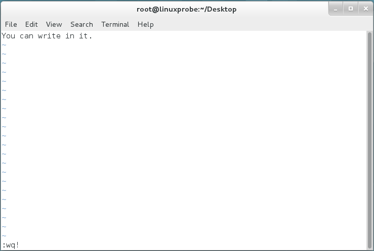

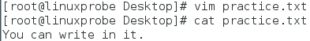

* 接下来在原文档后面追加 "This Sentence don't need to save"，然后按 Esc 键回到命令模式，输入 ":q" 不保存退出。
  * 系统会先询问是否覆写，所以必须加 ! 来强制退出。
  * 最后在命令行使用 cat 语句查看文本内容，发现内容没有修改：

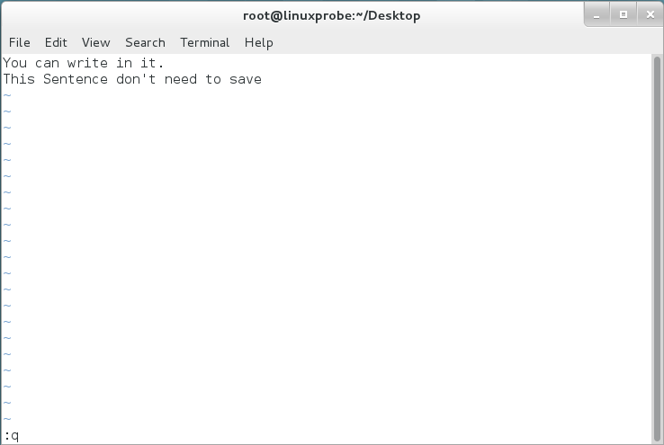

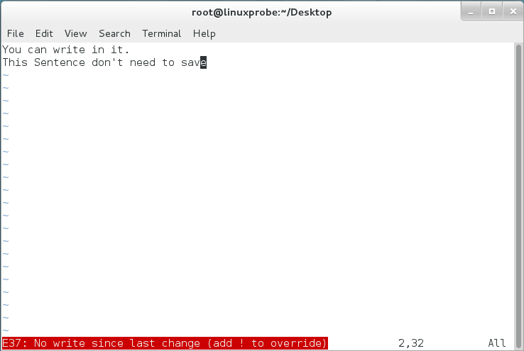

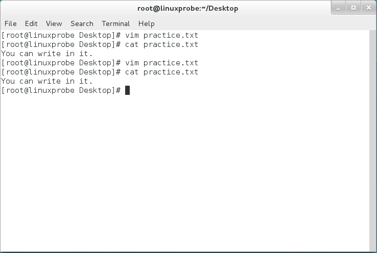

* 这就是简单的 vim 命令的使用。


## Vim 编辑器的应用

### 配置主机名称

* 为便于在局域网中查找特定的主机，或对主机进行区分，除要有 IP 地址外，还要为主机配置一个主机名，主机之间通过这个类似于域名的名称来互相访问。
* 在 Linux 系统中，主机名大多保存在 /etc/hostname 文件中，接下来将 /etc/hostname 文件的内容修改为 "linuxprobe.com":

#### 步骤

* 使用 Vim 编辑器修改 "/etc/hostname" 主机名称文件。
* 把原始主机名称删除后追加 "linuxprobe"。
  * 注意：Vim 修改主机名称文件后，要执行 :wq! 命令才能保存退出。
* 保存并退出文档，使用 hostname 命令检查是否修改成功。

#### 例子

* 原来 hostname 为 linuxprobe.com，修改为 linuxprobe。

```shell
vim /etc/hostname
# 进入编辑器，按i进入编辑，删除原名字（linuxprobe.com），增加linuxprobe，按Esc，输入:wq!退出
hostname
```

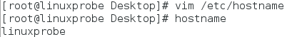


### 配置网卡信息

* 网卡 IP 地址配置是否正确是两台服务器是否可以相互通信的前提。在 Linux 系统中，一切都是文件，因此配置网络服务就是在编辑网卡配置文件。
* 在早期 Linux 系统中，如 RHEL 5、RHEL 6 中，网卡配置文件的前缀为 eth，第 1 块网卡为 eth0，第 2 块网卡为 eth1；以此类推。
* 而 RHEL 7 中，网卡配置文件的前缀以 ifcfg 开始，加上网卡名称共同组成了配置文件名，例如 ifcfg-eno16777736。
* 本节任务是，将网卡设备配置为开机自启动，并且 IP 地址、子网、网关等信息由人工指定。

#### 步骤

* 切换到 /etc/sysconfig/network-scripts 目录中（存放网卡配置文件）；
* 使用 Vim 编辑器修改网卡文件 ifcfg-eno16777736，逐项写入下面的配置参数，然后保存退出。
  * 由于每台设备的硬件及架构是不一样的，因此请读者使用 ifconfig 命令自行确认各自网卡的默认名称。
  * 需要写入的参数：
  * 设备类型：TYPE=Ethernet
  * 地址分配模式：BOOTPROTO=static
  * 网卡名称：NAME=eno16777736
  * 是否启动：ONBOOT=yes
  * IP 地址：IPADDR=192.168.10.10
  * 子网掩码：NETMASK=255.255.255.0
  * 网关地址：GATEWAY=192.168.10.1
  * DNS 地址：DNS1=192.168.10.1
* 重启网络服务并测试网络是否连通。

#### 例子

* 下面展示了修改网卡的步骤。需要修改 BOOTPROTO、ONBOOT 参数，增添 IPADDR、NETMASK、GATEWAY、DNS1 四个参数。

```shell
cd /etc/sysconfig/network-scripts/
ls
vim ifcfg-eno16777728
# 修改内容（见下图1）
systemctl restart network
ping 192.168.10.10
^C # 终止ping
```

* ifcfg-eno16777728 文件编辑：

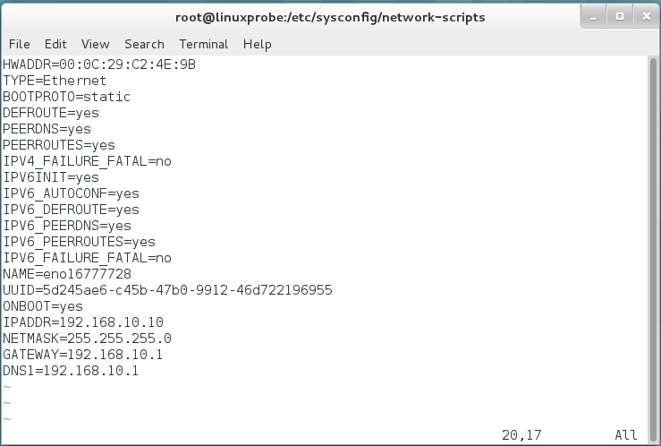

* Command：

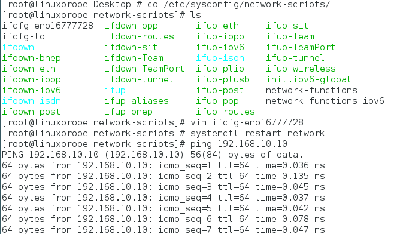


### 配置 Yum 软件仓库

* Yum 软件仓库的作用是为了进一步简化 RPM 管理软件的难度以及自动分析所需软件包以及依赖关系。
* 具体存储以及设备挂载的操作要在第 6 章才会讲解，因此本章重心是学习 Vim 编辑器。

#### 步骤

* 进入到 /etc/yum.repos.d/ 目录中（该目录存放配置文件）。
* 使用 Vim 编辑器创建一个名为 rhel7.repo 的新配置文件（文件名随意，但后缀名必须为 .repo），逐项写入下面的配置参数。（写加粗部分，不写后面的注释）：
  * **[rhel-media]**：Yum 软件仓库唯一标识符，避免与其他仓库冲突。
  * **name=linuxprobe**：Yum 软件仓库的名称描述，易于识别仓库用处。
  * **baseurl=file:///media/cdrom**：提供的方式包括 FTP（ftp://..）、HTTP（http://..）、本地（file:///..）。
  * **enabled=1**：设置此源是否可用；1为可用，0为禁用。
  * **gpgcheck=1**：设置此源是否校验文件；1为校验，0为不校验。
  * **gpgkey=file:///media/cdrom/RPM-GPG-KEY-redhat-release**：若上面参数开启校验，需要执行校验公钥文件地址。

* 按配置参数的路径挂载光盘，并把光盘挂载信息写入到 /etc/fstab 文件中。
* 使用 "yum install httpd -y" 命令检查 Yum 软件仓库是否已经可用。

#### 例子

* 下面展示 Yum 配置的例子：

```shell
cd /etc/yum.repos.d/
vim rhel7.repo
mkdir -p /media/cdrom
mount /dev/cdrom /media/cdrom
vim /etc/fstab
yum install httpd
# ... Complete!
```

* rhel7.repo 文件编辑：

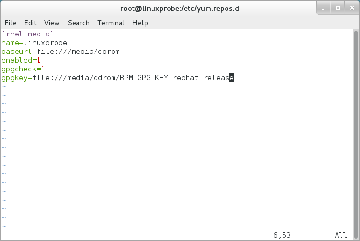

* /etc/fstab 文件编辑：

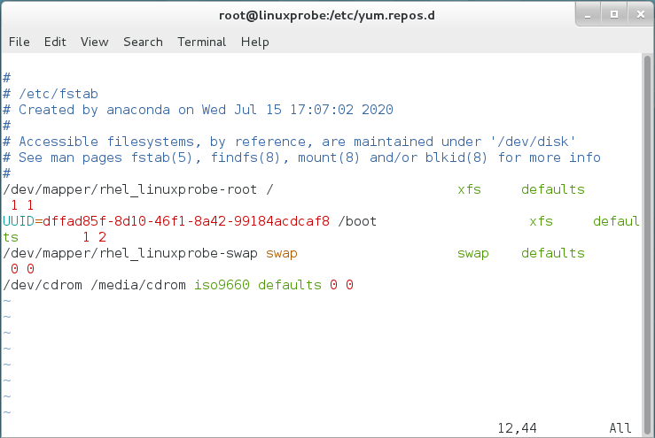

* Command：

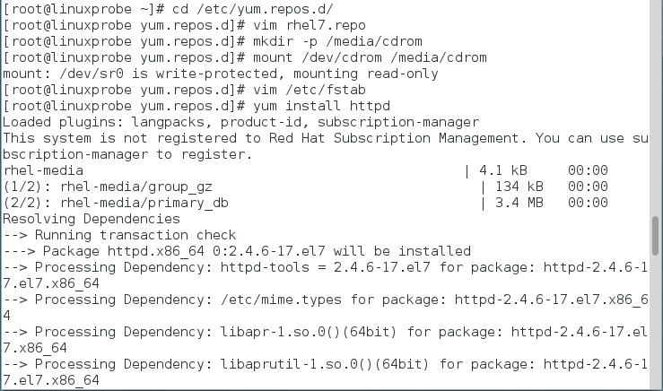


## 编写 Shell 脚本

* Shell 解释器作为人与计算机硬件的 "翻译官" 和用户与 Linux 内部的通信媒介，正确下达命令，运用其功能特性尤为重要。
* Shell 脚本命令的工作方式有两种：交互式与批处理。
  * 交互式（Interactive）：用户每输入一条命令就立即执行；
  * 批处理（Batch）：由用户实现编写好一个完整的 Shell 脚本，由 Shell 一次性执行脚本中的命令。
* Shell 脚本中不仅会用到前面学习的 Linux 命令、正则表达式、管道符、重定向等语法规则，还需要把内部功能模块化后处理，最终形成 Shell 脚本。


### 简单的 Shell 脚本

#### 查看 SHELL 变量

* 通过查看 SHELL 变量可以发现系统用什么作为 Shell 的命令行解释器，这里可以看出用的是 Bash：

```shell
echo $SHELL
# /bin/bash
```

#### 脚本范例

* 下例展示了一个查看**当前所在工作路径**并列出当前目录下**所有的文件及属性信息**。

```shell
vim example.sh
```

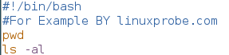

#### 脚本注意点

* 脚本以 .sh 为后缀，这是为了区分脚本文件与普通文件。
* 脚本中第一行的脚本声明（#!）用来告诉系统使用哪种 Shell 解释器来执行该脚本。
* 脚本中第二行的注释信息（#）是对脚本功能和某些命令的介绍信息，使自己和他人在日后看到脚本时，快速知道脚本的作用和警告。
* 脚本中后面的内容就是平时执行的 Linux 命令。

#### bash 直接执行

* 对于用 bash 解释器可以直接执行的命令，用于 bash 命令可以直接执行：

```shell
bash example.sh
```

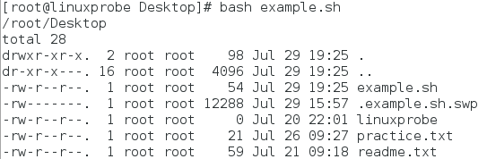

#### 完整路径执行

* 通过输入完整路径的方式也可以执行。但是默认会因为权限不足而提示报错信息。此时需要为脚本文件添加执行权限（第 5 章）即可。等到第 5 章再讨论用户身份和权限的问题。

```shell
./example.sh
chomd u+x example.sh
./example.sh
```

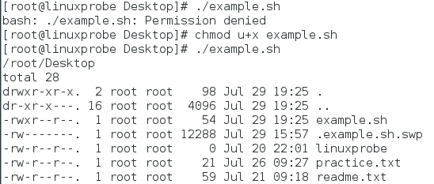


### 接受用户参数

* 上述脚本程序只能执行一些预设的功能，为更好地满足用户的实时需求，达到灵活工作的目的，必须让脚本程序能够接受用户输入的参数。
* Linux 系统中的 Shell 脚本语言早就考虑到这些，已经内设了用于接受参数的变量，变量之间可以使用空格间隔。
  * 例如，$0 对应的是当前 Shell 脚本程序的名称；
  * $# 对应的是总共有几个参数；
  * $* 对应的是所有位置的参数值；
  * $? 对应的是显示上一次命令的执行返回值；
  * $N 对应的是第 N 个位置的参数值（从 1 开始）。

```shell
vim example.sh
sh example.sh one two three four five six
```

* example.sh 文本编辑：

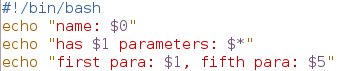

* Command 执行：

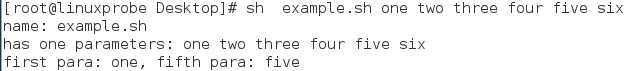


### 判断用户的参数

* 为了进一步处理用户输入的参数，系统需要经常判断用户的信息。
  * 例如，mkdir 命令会判断用户输入的信息，若指定的文件夹名称存在，则提示报错，否则自动创建。
* 与其他语言一样，Shell 解释器通过条件测试语法判断表达式是否成立。
  * 请注意，若表达式成立返回数字 **0**，反之返回其他随机数值。（与一般的判断相反）

#### 格式

* 条件表达式的格式如下，请注意，条件表达式两边均应**有一个空格**：
* [ 条件表达式 ]

#### 分类

* 按照测试对象来划分，条件测试语句有 4 种形式：
  * 文件测试语句；
  * 逻辑测试语句；
  * 整数值比较语句；
  * 字符串比较语句。
* 下面 4 节针对这 4 种格式进行分别说明。


### 文件测试

* 文件测试即使用指定条件来判断文件是否存在，或权限是否满足等情况的运算符。

#### 参数

* 具体参数如下所示：

| 运算符 | 作用                       |
| ------ | -------------------------- |
| -d     | 测试文件是否为目录类型     |
| -e     | 测试文件是否存在           |
| -f     | 判断是否为一般文件         |
| -r     | 测试当前用户是否有权限读取 |
| w      | 测试当前用户是否有权限写入 |
| -x     | 测试当前用户是否有权限执行 |

#### 例1：判断文件类型

* 下面使用文件测试语句来判断 /etc/fstab 是否为一个目录类型的文件，
  * 然后用 Shell 解释器的内置变量 $? 来返回上一条语句的返回值。
* 若返回 0，表明目录存在，否则目录不存在。

```shell
[ -d /etc/fstab ]
echo $?
```

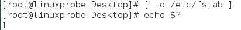

#### 例2：判断文件是否为一般文件

* 下面使用文件测试语句来判断 /etc/fstab 是否为一般文件，
  * 如果返回值为 0，则代表文件存在，否则文件不存在。

```shell
[ -f /etc/fstab ]
echo $?
```

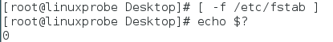


### 逻辑测试

* 逻辑测试用于对测试结果进行逻辑分析，根据测试结果实现不同效果。

#### 逻辑与 &&

* 逻辑与的运算符号是 "&&"，表示当前面的命令**执行成功后**才会执行它**后面的命令**。
* 下例用来判断 /dev/cdrom 文件是否存在，若存在则输出 Exist 字样。

```shell
[ -e /dev/cdrom ] && echo "Exist"
```

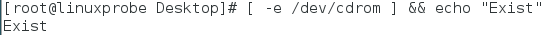

#### 逻辑或 ||

* 逻辑或的运算符号是 "||"，表示当前面的命令**执行失败后**才会执行它**后面的命令**。
* 下例结合系统环境变量 USER 来判断当前登录的用户是否为非管理员身份：

```shell
echo $USER
[ $USER = root ] || echo "user"
su - linuxprobe
[ $USER = root ] || echo "user"
```

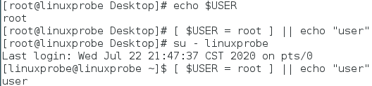

#### 逻辑非 !

* 逻辑非的运算符号是叹号 "!"，表示把条件测试中的判断结果取反值。即将正确变成错误，错误变成正确。
* 下例首先切换到 root 管理员身份，判断当前用户是否为一个非管理员的用户。
  * 若当前用户（不）是管理员（是错误的），则打印 "administrator"：

```shell
exit
[ ! $USER = root ] || echo "administrator"
```

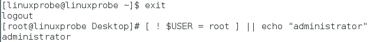

#### 组合示例

* 下面介绍一个组合使用三种运算输出的小例子。这是希望读者日后能灵活地使用这些符号。
* 假设我们要完成以下的功能，若用户是非管理员，则输出 "user"，否则输出 "root"：

```shell
[ ! $USER = root ] && echo "user" || echo "root"
```


### 整数值比较

* 整数比较运算符仅用于对数字的操作，下面是一些注意点：
  * 不能将数字与字符串、文件等内容一起操作。
  * 不能想当然地使用日常生活中的等号、大于号、小于号来判断，因为等号的意义是赋值语句，大于小于号与重定向命令冲突。
  * 下面将介绍一些规范的整数运算符。

#### 整数比较运算符

* 下面介绍一些整数可用的比较运算符：

| 运算符 | 作用           |
| ------ | -------------- |
| -eq    | 是否等于       |
| -ne    | 是否不等于     |
| -gt    | 是否大于       |
| -lt    | 是否小于       |
| -le    | 是否小于或等于 |
| -ge    | 是否大于或等于 |

#### 例1：简单数值判断

* 首先用一个简单的例子来说明使用方法，该例子的意思是 10 是否大于 10 以及 10 是否等于 10。

```bash
[ 10 -gt 10 ]
echo $?
[ 10 -eq 10 ]
echo $?
```

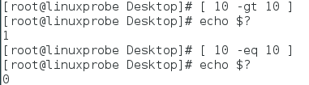

#### 例2：free 获取当前内存量

* 下面介绍一个用 free 命令获取内存量使用情况的例子。
  * 首先使用 free -m 命令查看内存使用量情况（单位 MB）；
  * 然后通过 grep Mem: 命令获取剩余内存量的行；
  * 通过 awk '{print $4}' 命令只保留第 4 列；
  * 最后将执行结果赋值给 FreeMem 变量。

```bash
free -m
free -m | grep Mem:
free -m | grep Mem: | awk '{print $4}'
FreeMem=`free -m | grep Mem: | awk '{print $4}'`
echo $FreeMem
```

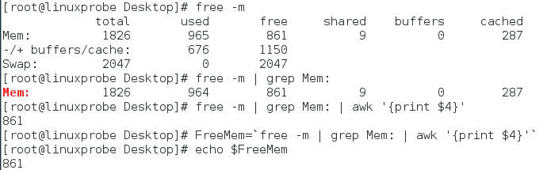

* 上面的内容了解即可，下面的是重点：
  * 使用整数运算符来判断内存可用量是否小于 1024，若小于则提示 "Insufficient Memory" 字样。

```shell
[ $FreeMem -lt 1024 ] && echo "Insufficient Memory"
```

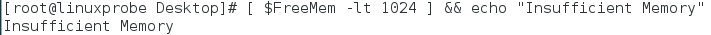


### 字符串比较

* 字符串比较语句用于判断测试字符串是否为空值，或两个字符串是否相同。
* 它经常用来判断变量是否未被定义（即内容为空值）。

#### 字符串比较运算符

| 运算符 | 作用                   |
| ------ | ---------------------- |
| =      | 比较字符串内容是否相同 |
| !=     | 比较字符串内容是否不同 |
| -z     | 判断字符串内容是否为空 |

#### 例1：判断字符串是否为空

* 下例判断了字符串 String 变量是否为空值，进而判断是否定义了这个变量：

```shell
[ -z $String ]
echo $?
```

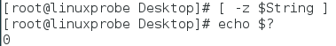

#### 例2：综合使用逻辑运算和字符串比较

* 下例综合使用了逻辑运算和字符串比较运算，当用于保存当前语系的环境变量值 LANG 不是英语（en.US）时，则会满足逻辑测试条件并输出 "Not en.US" （非英语）字样：

```shell
echo $LANG
[ $LANG != "en.US" ] && echo "Not en.US"
```

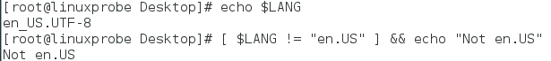


## 流程控制语句

* 对于生产环境来说，仅仅使用 Linux 命令、管道符、重定向以及条件测试语句来编写 Shell 脚本是不合适的。
* 这是因为这些命令不能根据真实的工作需求来调整具体的执行命令，也不能根据条件自动循环执行。
* 接下来通过 if、for、while、case 这 4 中流程控制语句来学习编写难度更大、功能更强的 Shell 脚本。

### if 条件测试语句

* if 条件测试语句可以让脚本根据情况自动执行相应命令。
* 从技术角度讲，if 语句分为单分支、双分支、多分支等。

#### 单分支结构

* if 条件语句的单分支结构由 if、then、fi 三个关键词组成。表示只在条件成立时才执行预设的命令。其作用相当于 "如果 ... 那么 ..."。

* 其语法格式如下：

```shell
if 条件测试操作
    then 命令序列
fi
```

* 例如（不加命令）：

```shell
if 目录不存在
    then 创建该目录
fi
```

* 下面使用单分支的 if 条件语句来判断 /media/cdrom 文件是否存在，若存在就结束条件判断，反之创建这个目录：

```shell
vim mkcdrom.sh
# 以下是 shell 脚本内容
#!/bin/bash
DIR="/media/cdrom"
if [ ! -e $DIR ]
then
mkdir -p $DIR
fi
```

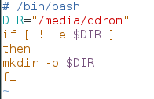

* 下面通过 ls 来查看是否创建了该目录：

```shell
bash mkcdrom.sh
ls -d /media/cdrom
```

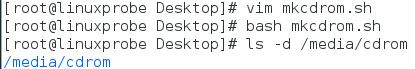

#### 双分支结构

* if 条件语句的双分支结构由 if、then、else、fi 关键词组成，它相当于 "如果 ... 那么 ... 或者 ..."。

* 其语法结构如下：

```shell
if 条件测试操作
    then 命令序列1
    else 命令序列2
fi
```

* 例如（不加命令）：

```shell
if 能够ping通
    then 提示服务器正常工作
    else 报警服务器出现问题
fi
```

* 下面使用双分支的 if 条件语句来验证某台主机是否在线，然后根据返回值的结果，要么显示主机在线信息，要么显示不在线信息。
* 这里使用 ping 命令来测试与对方主机的网络连通性，而 Linux 系统中的 ping 命令不想 Windows 一样尝试 4 次就结束，
  * 因此为了避免用户等待时间过长，需要通过 -c 参数规定尝试次数，使用 -i 参数定义每个数据包的发送间隔，使用 -W 参数定义等待超时时间。

```shell
vim chkhost.sh
# 以下为 shell 脚本内容：
#!/bin/bash
ping -c 3 -i 0.2 -W 3 $1 &> /dev/null
if [ $? -eq 0 ]
then
echo "Host $1 is On-line."
else
echo "Host $1 is Off-line."
fi
```

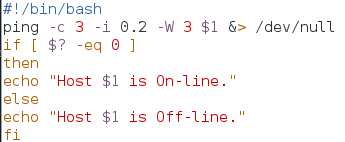

* 由于 $? 变量作用是显示上一次命令的返回值。若前面的语句成功执行，则该变量显示数字 0，反之则显示一个非零的数字。
* 因此使用比较运算符来判断 $? 变量是否为 0，从而获知那条语句的最终判断情况。
* 下面我们验证一下脚本的效果，假设服务器 IP 地址为 192.168.10.10（之前配置过网络服务器），来验证一下脚本的效果：

```shell
bash chkhost.sh 192.168.10.10
bash chkhost.sh 192.168.10.20
```

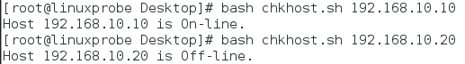

#### 多分支结构

* if 语句的多分支结构由 if、then、else、elif、fi 关键词组成，它进行多次条件匹配判断，多次判断中任何一项匹配成功都会执行预设命令，相当于 "如果 ... 那么 ... 如果 ... 那么 ..."。该语法的用法更加灵活。
* 语法结构如下所示：

```shell
if 条件测试操作1
    then 命令序列1
elif 条件测试操作2
    then 命令序列2
else
    命令序列3
fi
```

* 例如（不加命令）：

```shell
if 分数为85~100之间
    then 判为优秀
elif 分数为70~84之间
    then 判为合格
else
    判为不合格
fi
```

* 下面使用多分支的 if 语句判断用户输入的分数在哪个成绩区间内，然后输出 Excellent、Pass、Fail 等提示信息。
* 在 Linux 系统中，read 是用来读取用户输入信息的命令，能够接受用户输入的信息赋值给后面的指定变量，-p 参数用于向用户显示一定的提示信息。脚本意义与上面的例子几乎一致：

```shell
vim chkscore.sh
# 以下为 shell 脚本内容：
#! /bin/bash
read -p "Enter your score (0-100): " GRADE
if [ $GRADE -ge 85 ] && [ $GRADE -le 100 ] ; then
echo "$GRADE is Excellent"
elif [ $GRADE -ge 70 ] && [ $GRADE -le 84 ] ; then
echo "$GRADE is Pass"
elif [ $GRADE -ge 0 ] && [ $GRADE -le 69 ] ; then
echo "$GRADE is Fail"
else
echo "ERROR!"
fi
```

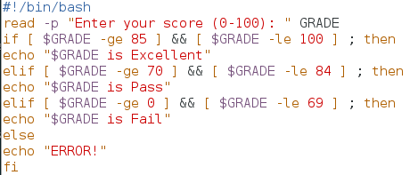

```shell
bash chkscore.sh
```

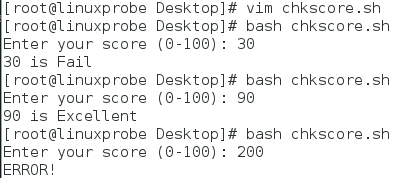


### for 条件循环语句

* for 循环语句允许脚本一次性读取多个信息，然后逐一进行操作处理。
* for 循环也适合当数据存在范围时使用。

#### 语法格式

* for 循环的语法格式如下：

```shell
for 变量名 in 取值列表
do
    命令序列
done
```

* 例如（不加命令）：

```shell
for 用户名 in 列表文件
do
    创建用户并设置密码
done
```

#### 例1：创建用户账户

* 下例使用 for 循环从列表文件中读取多个用户名，为其注意创建用户账户并设置密码。
* 首先创建列表文件 users.txt，每个用户名称单独一行。
* user.txt 列表文件：

```shell
vim users.txt
andy
barry
carl
duke
```

* 接下来编写 Shell 脚本 Example.sh。
  * 在脚本中使用 read 命令读取用户输入的密码值，然后赋值给 PASSWD 变量，并通过 -p 参数向用户显示一段提示信息；
  * 在执行该脚本后，会自动使用从列表文件 users.txt 中获取所有的用户名称，然后逐一使用 "id 用户名" 命令查看用户信息；
  * 查看后使用 $? 判断命令是否执行成功，即判断用户是否存在。
* 需要注意，/dev/null 是一个被称作 Linux 黑洞的文件，把输出信息重定向到这个文件等同于删除数据（类似于没有回收功能的垃圾箱），可以让用户的屏幕窗口保持简洁。

```shell
vim Example.sh
#!/bin/bash
read -p "Enter The Users Password : " PASSWD
for UNAME in `cat users.txt`
do
    id $UNAME &> /dev/null
    if [ $? -eq 0 ]
    then
        echo "Already exists"
    else 
        useradd $UNAME &> /dev/null
        echo "$PASSWD" | passwd --stdin $UNAME &> /dev/null
        if [ $? -eq 0 ]
        then
            echo "$UNAME , Create success"
        else
            echo "$UNAME , Create failure"
        fi
    fi
done   
```

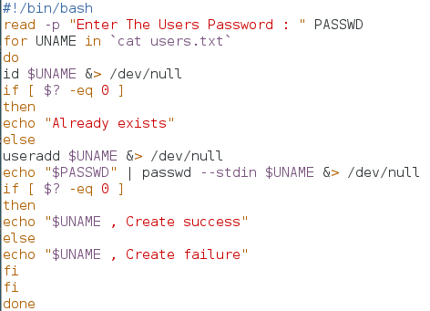

* 执行批量创建用户的 Shell 脚本 Example.sh，输入账户设定的密码后将由脚本自动检查并创建这些账户。
  * 由于已经将多余的信息转移到 /dev/null 黑洞文件中，因此在正常情况下屏幕窗口只显示 "Create Success" 提示。
* 在 Linux 系统中，/etc/passwd 是用来保存用户账户信息的文件。如果想确认这个脚本是否成功创建了用户账户，可以打开这个文件，看是否有这些新创建的信息。

```shell
bash Example.sh
tail -4 /etc/passwd
```

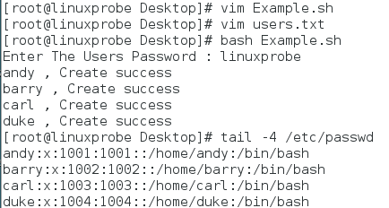

#### 例2：判断主机是否在线

* 双分支 if 语句中学习了如何测试主机在线的脚本（用 ping 命令），现在已经掌握了 for 循环语句，可尝试让脚本从文件中自动读取主机列表，然后逐个测试是否在线：
* 先创建主机列表文件 ipadds.txt：

```shell
vim ipadds.txt
192.168.10.10
192.168.10.11
192.168.10.12
```

* 下面脚本中出现的 $(命令) 是一种完全类似于第 3 章的转义字符中反引号的 Shell 操作符，效果同样是执行字符串中的命令。

```shell
vim CheckHosts.sh
#!/bin/bash
HLIST=$(cat ~ipadds.txt)
for IP in $HLIST
do
    ping -c 3 -i 0.2 -W 3 $IP &> /dev/null
    if [ $? -eq 0 ] ; then
    echo "Host $IP is On-line."
    else
    echo "Host $IP is Off-line."
    fi
done
```

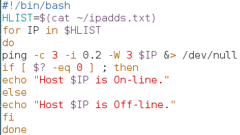

```shell
bash CheckHosts.sh
```

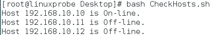


### while 条件循环语句

* while 循环让脚本根据某些条件来重复执行某些命令。

#### 语法格式

* 语法格式如下：

```shell
while 条件测试操作
do
    命令序列
done
```

* 例如：

```shell
while 未猜中正确价格
do
    反复猜测商品价格
done
```

#### 例：猜测数值大小

* 下例是一个用来猜测数值大小的脚本 Guess.sh：
* 要点：
  * $RANDOM 变量调取一个随机数值（范围为 0~32767）；接着进行 % 1000 取余，并使用 expr 命令取结果。
  * 若 while 循环的条件测试判断为 true，则循环会无限执行下去。
  * exit 0 终止脚本运行。
  * TIMES 变量统计了猜测次数。
* 程序：

```shell
vim Guess.sh
#!/bin/bash
PRICE=$(expr $RANDOM % 1000)
TIMES=0
echo "guess!"
while true
do
    read -p "enter a price: " INT
    let TIMES++
    if [ $INT -eq $PRICE ] ; then
        echo "yes, the price is $PRICE"
        echo "you guess $TIMES times in total"
        exit 0
    elif [ $INT -gt $PRICE ] ; then
        echo "too high!"
    else
        echo "too low!"
    fi
done
```

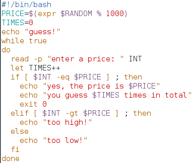

* 调用：

```shell
bash Guess.sh
```

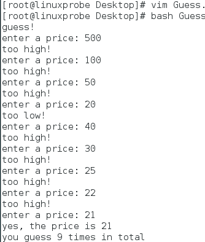


### case 条件测试语句

* case 语句是在多个范围内匹配数据。
  * 若匹配成功则执行相关命令，并结束条件测试；
  * 如果数据不在列出的范围内，则会去执行星号（*）所定义的默认命令。

#### 语法结构

* 语法结构如下：

```shell
case 变量值 in
模式1)
    命令序列1
    ;;
模式2)
    命令序列2
    ;;
    ......
*)
    默认命令序列
esac
```

* 例如：

```shell
case 输入的字符 in
[a-z]|[A-Z])
    提示为字母。
    ;;
[0-9])
    提示为数字。
    ;;
    ......
*)
    提示为特殊字符
esac
```

#### 例：数字或字母

* 注意：if 后面的数值判断只能接受数字，而不能接受字母，比如 "a 大于 3" 这样的说法是无意义的。而 case 可以。
* 下面的脚本 Checkkeys.sh，提示用户输入一个字符并将其赋值给变量 KEY，然后根据变量 KEY 的值向用户显示值是字母、数字还是其他字符：

```shell
vim Checkkeys.sh
#!/bin/bash
read -p "Enter a character : " KEY
case "$KEY" in
[a-z]|[A-Z])
    echo "letter."
    ;;
[0-9])
    echo "number."
    ;;
*)
    echo "other character."
esac
```

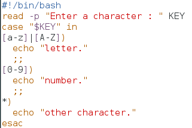

```shell
bash Checkkeys.sh
```

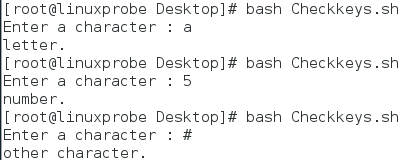


## 计划任务服务程序

* 在 Linux 无需人为介入的情况下，在指定的时间段自动启用或停止某些服务或命令，从而实现运维的自动化。
* 下面介绍如何设置服务器的计划任务服务，把周期性、规律性的工作交给系统自动完成。
* 计划任务分为**一次性计划任务**和**长期性计划任务**：
  * 一次性计划任务：例如今晚 11 点 30 分开启网站服务。用于满足临时的工作需求。用 at 命令实现。
  * 长期性计划任务：例如每周一的凌晨 3 点 25 分把 /home/wwwroot 目录打包备份为 backup.tar.gz。周期性地、有规律地执行某任务。用 crond 服务来实现。

### 一次性计划任务

#### 用法

* "at 时间" ：设置一次性任务。
* "at -l" ：查看已设置好但还未执行的一次性任务。
* "atrm 任务序号" ：删除一次性任务。
* at 设置一次性任务，默认采用的是交互式方法。按 Ctrl + d 结束编写任务。

#### 例子

* 下面的命令将系统设置为在今晚 23:30 分重启网站服务。

```shell
at 23:30
at > systemctl restart httpd
at > (ctrl+d)
at -l
```

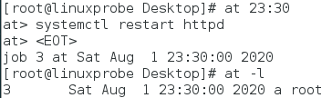

* 使用管道符也可以实现这样的操作：

```shell
echo "systemctl restart httpd" | at 23:30
at -l
```

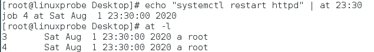

* 删除一个任务：

```shell
atrm 3
at -l
```

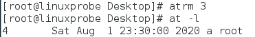


