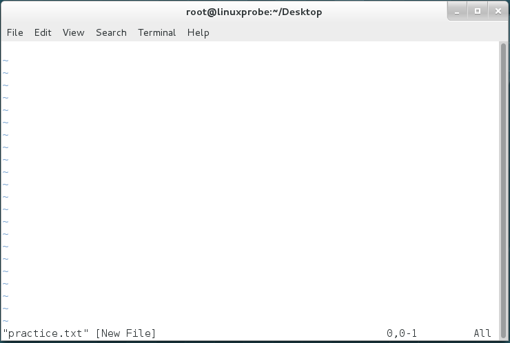
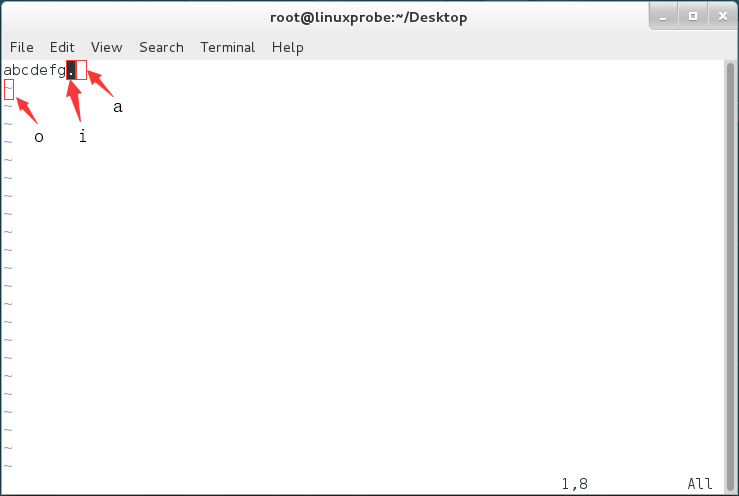

# Linux 学习笔记（四）Vim 编辑器与 Shell 命令脚本

* 本笔记基于 刘遄 的《Linux 就该这么学》一书。
* 本章将首先介绍。。。正在制作中。
* 需要注意，本笔记排版与原书的介绍顺序有所不同，会将**理论内容放在前面**讲解，**实践内容放在最后**。
  * 当理论内容介绍完毕，笔记会加以注释参看相关实践内容。


## Vim 文本编辑器

* 在 Linux 系统中一切都是文件，而配置一个服务就是在**修改其配置文件的参数**。
* 在日常工作中也免不了要编写文件，这些工作都是通过**文本编辑器**完成的。
* 选择使用 Vim 文本编辑器来完成，它默认安装在所有的 Linux 系统上，是一款超棒的文本编辑器。
* 下面我们边介绍 Vim 编辑器的用法，边体会 Vim 编辑器的特色。


### 三种模式

* Vim 编辑器设置了三种模式——命令模式、末行模式和编辑模式。每种模式也支持多种不同的快捷键，可实现高效操作文本。

#### 模式作用

* 命令模式：控制光标移动，可对文本进行复制、粘贴、删除和查找等工作。
* 输入模式：正常的文本录入。
* 末行模式：保存或退出文档，以及设置编辑环境。

#### 模式切换

* 每次运行 Vim 文本编辑器时，**默认进入命令模式**。输入模式和末行模式都必须通过命令模式进入（换句话说，不能直接从输入模式到末行模式，也不能直接从末行模式到输入模式）。
* 出命令模式：按 a, i, o 等键可进入输入模式，按 : 键可进入末行模式。
* 返回命令模式：无论出于哪个模式，按 Esc 键即返回命令模式。
* 可以认为，命令模式是一个主菜单，而输入和末行模式是两个子菜单。必须从主菜单进入子菜单，从子菜单返回主菜单。


### 常用命令

#### 命令模式

* 下表总结了在命令模式下的常用命令：

| 命令 | 作用                                               |
| ---- | -------------------------------------------------- |
| dd   | 删除（剪切）光标所在整行                           |
| 5dd  | 删除（剪切）从光标处开始的 5 行                    |
| yy   | 复制光标所在整行                                   |
| 5yy  | 复制从光标处开始的 5 行                            |
| n    | 显示搜索命令定位到的下一个字符串                   |
| N    | 显示搜索命令定位到的上一个字符串                   |
| u    | 撤销上一步的操作                                   |
| p    | 将之前删除（dd）或复制（yy）过的数据粘贴到光标后面 |

#### 末行模式

* 末行模式主要用于保存或退出文件，以及设置 Vim 编辑器的工作环境，还可以让用户执行外部的 Linux 命令或跳转到所编写文档的特定行数。切换到末行模式用冒号（：）就可以。
* 下表总结了在末行模式下的常用命令：（这里默认是从命令模式开始输入的）

| 命令          | 作用                                    |
| ------------- | --------------------------------------- |
| :w            | 保存                                    |
| :q            | 退出                                    |
| :q!           | 强制退出（放弃对文档的修改内容）        |
| :wq!          | 强制保存退出                            |
| :set nu       | 显示行号                                |
| :set nonu     | 不显示行号                              |
| :命令         | 执行该命令                              |
| :整数         | 跳转到该行                              |
| :s/one/two    | 将当前光标所在行的第一个 one 替换成 two |
| :s/one/two/g  | 将当前光标所在行的所有 one 替换成 two   |
| :%s/one/two/g | 将全文中的所有 one 替换成 two           |
| ?字符串       | 在文本中从下至上搜索该字符串            |
| /字符串       | 在文本中从上至下搜索该字符串            |


## Vim 编写简单文档

* 本部分我们尝试编写一个简单的脚本文档。

### 新建文件

* 采用 "vim 文件名" 的命令格式可以新建一个文档。如果该文件名已存在，则会**打开已有文档**，否则**创建一个临时输入文件**。

```shell
vim practice.txt
```



* 进入文件后会首先进入编辑器的命令模式，按 a, i, o 三个键都可以进入输入模式。
  * a 键会将光标移动到后面一位；
  * i 键会将光标移动到当前位置；
  * o 键会在下面新建一个空行，并移动到那个位置。
* 这里假设我们已经在编辑状态下写了如下的内容，并将指针停在如下位置：
  * 那么 a 键、i 键、o 键按下后的位置就如下面的红色框中所示。



* 下面就可以尽情地写文本了。

